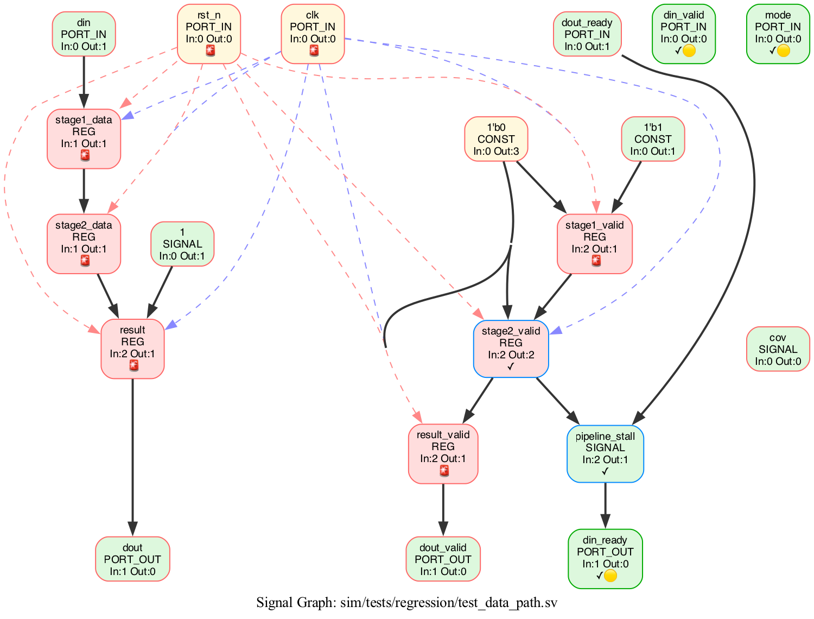
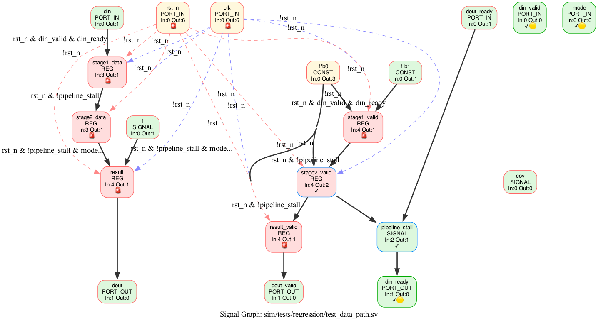
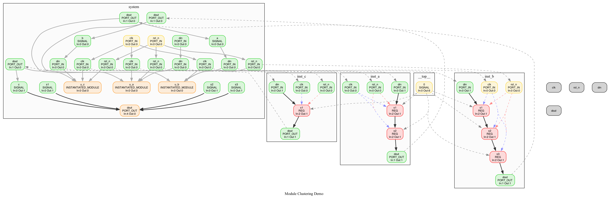
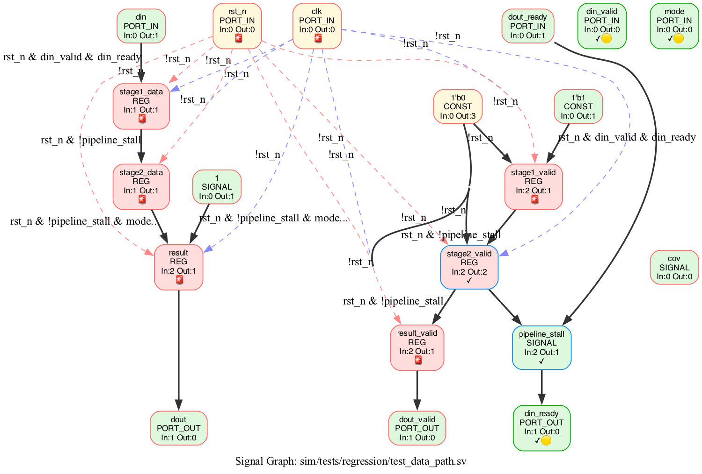
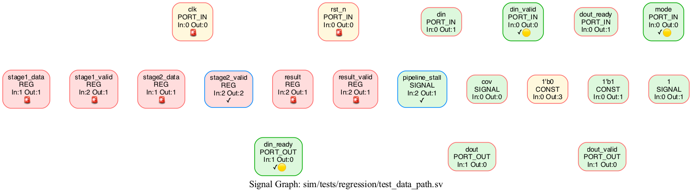

# sv_query - SystemVerilog 信号追踪查询引擎

**让验证工程师直接问"这个信号谁驱动的"，而不是去读代码。**

[]()
[]()
[](LICENSE_MIT)
[](LICENSE)

---

## 💡 为什么用 sv_query？  

- ✅ **位精确**: 知道信号 [3:0] 从哪里来，到哪里去
- ✅ **跨模块**: 穿透子模块实例，追踪真实的物理连接
- ✅ **4 维分析**: module 抽取 (L1) + 端口连接 (L2) + 内部信号 (L3) + 可视化 (L4)
- ✅ **全场景**: 验证问题、CDC、时序、风险、缺口检测
- ✅ **可视化**: 自动生成 Graphviz 交互图
- ✅ **多文件**: Verilator 风格 filelist 支持 (CVA6 级别)
- ✅ **协议检测**: 自动识别 AXI4/TL-UL/AHB/APB/Wishbone,4 项置信度融合
- ✅ **Dataflow/Pipeline 可视化**: 基于 SignalGraph 自动分类 control/data,检测 pipeline stages
- ✅ **Fix 修复子系统**: 一键修 timescale/imports/widths,按错误类别分组报告
- ✅ **2280 测试**: 稳定可靠，覆盖核心功能

---

## 🚀 5 分钟快速上手

### 1. 安装

```bash
pip install -e .
```

### 2. 准备一个 SV 文件

```systemverilog
// top.sv
module top(input clk, rst_n, input [7:0] data, output [7:0] result);
    logic [7:0] temp;
    always_ff @(posedge clk) begin
        if (!rst_n)
            temp <= 8'h0;
        else
            temp <= data;
    end
    assign result = temp;
endmodule
```

### 3. 查询信号驱动

```bash
python run_cli.py trace fanin top.result -f top.sv
```

**输出示例：**

```
=== Drivers for top.result ===
Source Signal | Condition | Source File
--------------+-----------+------------
top.temp | Always | top.sv:8
        ↓ (via always_ff)
top.clk | Rising Edge | top.sv:1
top.rst_n | Active Low | top.sv:1

Confidence: Certain
```

### 4. 加速重复查询（可选）

```bash
# 第一次运行（解析 AST）
python run_cli.py trace fanin top.result -f top.sv

# 第二次运行（使用缓存，跳过重复解析）
python run_cli.py trace fanin top.result -f top.sv --cache
```

### 5. 查看模块架构 (L1)

```bash
# 抽取 target module 的 sub-instance 树 (L1 + L4 边)
python run_cli.py visualize module --filelist filelist.f \
  --target axi_xbar_intf --depth 3
```

```text
Target: axi_xbar_intf
Depth: 3
Instances: 3
  └─ i_xbar        (def=axi_xbar, depth=1)
    └─ i_xbar_unmuxed (def=axi_xbar_unmuxed, depth=2)
      └─ i_axi_demux  (def=axi_demux, depth=3)
```

---

## 🆕 最近更新 (2026-06)

- ✨ **Coverage gap 检测** (2026-06-23): 新增 `coverage gap` 子命令,
  自动检测 covergroup ↔ constraint 一致性缺口 (missing_cross /
  missing_illegal_bins / missing_bins)。支持 `--class` 过滤、
  `--json` 输出、`--fail-on-gap` CI 集成。修 CovergroupAnalyzer
  cross.items NAME vs SIGNAL 错位 bug (永真 mismatch)。
- ✨ **协议检测 (Phase A)**: `protocol detect` 自动识别 AXI4/TL-UL/AHB/APB/Wishbone/Stream
  协议, 4 项置信度融合 (name+structural+pattern+handshake)。
  `--protocol TL-UL` 单协议模式避免多协议竞争误识别。
  详见 [docs/OPENTITAN_HOWTO.md](docs/OPENTITAN_HOWTO.md)
- ✨ **Dataflow 可视化**: `visualize dataflow` 自动分类 clock/reset/control/data,
  显示运算表达式 (a+b) + MUX 选择 + 关键控制边。POC: uart/synchronizer/sync_fifo
- ✨ **Pipeline 可视化**: `visualize pipeline` 自动检测 pipeline registers
  (排除 FSM state regs),按 stage 分组,左→右时间流布局。7 stages for uart
- ✨ **fix 修复子系统**: `fix timescale` 自动补 `\`timescale; `fix report`
  按错误类别分组; `fix imports` 找 UndeclaredIdentifier 来源; `fix widths`
  用 pyslang.clog2 解析 typedef 真实位宽
- ✨ **SV Preprocessor**: 跨文件 `\`MACRO 展开, 解决 NaplesPU 12 个 TooFewArguments
- ✨ **NaplesPU 适配**: 完整跑通 RISC-V manycore (125 文件, strict pass with stubs),
  配套 HOWTO 文档
- ✨ **OpenTitan TL-UL 适配**: TileLink Uncached Lightweight 协议检测,
  TOP_PKG stub + filelist 排序方案

- ✨ **多文件 filelist 支持**: Verilator 风格的 `+incdir+`, `-F`, `${VAR}` 完整支持
- ✨ **CVA6 适配**: 工业级 RISC-V CPU 解析（macro_decoder 等模块）
- ✨ **CLI 新选项**: `--include`, `--filelist` 处理大型项目
- ✨ **正方形可视化**: ratio=compress 避免裁剪，size=10 英寸
- ✨ **Unicode 容错**: 防护 pyslang 在 CVA6 上的 UnicodeDecodeError
- 📚 **新文档**: `docs/FILELIST.md` 完整 filelist 文档
- ✨ **Evidence 召回从 trace 扩展到 5 个命令** (2026-06-04): cdc / verify / risk /
  dataflow / controlflow 现在都支持 `--evidence` 可选 flag
  (默认 off, `--evidence` 时在每条结果下方贴 1 行源码摘要, JSON
  返回完整 evidence 字段含 credibility_score)
  详见 [docs/EVIDENCE_FEATURE.md#stage-5-多命令-evidence-扩展](docs/EVIDENCE_FEATURE.md#stage-5-多命令-evidence-扩展-2026-06-04)
- 🐛 **Bugfix**: `cdc --json` 修复 tuple key 序列化 crash
  (Stage 1 以来隐藏, evidence 路径触发发现)
- ✨ **pyslang 10 + 11 双版本完整支持** (2026-06-04): 现在在 pyslang
  10.0.0 和 11.0.0 上都是 1501/1501 全过。v11 拆了 submodule + 改了
  4 个语义点 (SyntaxList 包装 / foreach loop var / class composition /
  ranges 内部), 都有 compat shim + 业务代码适配。
  详见 [docs/PYSLANG_COMPAT.md](docs/PYSLANG_COMPAT.md)

### 2026-06-13 ~ 2026-06-15 4 维能力 (L1-L4) 闭环

(7 PR 阶段。以下仅列点，不重复详细说明。)

- L1 module 抽取 + strict mode: `visualize module` 抽取 target module
  的 sub-instance hierarchy (axi_xbar_intf → i_xbar → i_xbar_unmuxed)。
  [PR1 `0ddd63d`]
- L2 跨模块 trace: wrapper port passthrough + port_to_internal 映射,
  跨过模块边界追到 leaf driver。 [PR2 `cc82cf2`]
- L3 内部信号追踪: `SignalTracer` 0 改 graph_builder, 复用已有
  `ModuleInstanceGraph` (MIG) 的 2569 个 port 映射, graph 0 results
  时 fallback MIG。 [PR3 `92e60c1`]
- L4 可视化增强: `visualize module` 加 cluster (按 wrapper 分组) +
  instance-to-instance 边 (port 名称 label) + `--mig/--no-mig`
  `--edges/--no-edges` flag。 [PR4 `16b3b97`]
- 端到端 benchmark: `tools/benchmark/run_benchmark.py` 跑真实项目,
  收集 L1+L2+L3+L4 数据, 输出 JSON + Markdown 报告。
  [PR5 `bba4491`]
- CI 集成 + regression check: `.github/workflows/benchmark.yml`
  + `tools/benchmark/check_regression.py` (L2 30% / L1-L4 50% / flakiness
  0.7 阈值)。 [PR6 `bf872e3`]
- picorv32 第二个项目: 单文件模式 (--files) + baselines 目录
  (picorv32.json, pulp_axi_xbar.json)。 [PR7 `275a43f`]

完整 4 维能力报告见 `docs/PYSLANG_MEMORY_ISSUE.md` (内存不足根因) +
`tools/benchmark/README.md` (benchmark 用法)。

详见 [CHANGELOG](docs/DOC_IMPL_GAP.md#更新日志)

---

## 用户场景

你是验证工程师，带着问题来，不是来学习架构的。

### 🔍 场景 1：我找不到这个信号是谁驱动的

```bash
python run_cli.py trace fanin top.result -f "**/*.sv"
```

### 📦 场景 2：我改了这个信号，会影响下游哪些逻辑？

```bash
python run_cli.py trace impact top.data -f "**/*.sv"
```

**输出示例：**

```
=== Impact Summary ===
Signal: top.data
Paths: 3 total, 1 high-risk

  1. 🔴 HIGH - clocked
     Path: top.data → top.buffer
     Fanout: 2 downstream loads
     ⚠️  No coverage (SVA: none, Covergroup: none)
     Condition: !!enable
     💡 Add SVA or coverage for this critical path

  2. ✅ LOW - combinational
     Path: top.data → top.result
     Fanout: 1 downstream loads
     ✓ SVA covered
```

**应用场景**：改信号前的安全检查，评估改动影响范围和风险


### 📦 场景 2.1：跨模块影响分析（穿透子模块）

**问题**：改信号时想知道它如何穿透子模块影响最终输出

```python
from trace.unified_tracer import UnifiedTracer

tracer = UnifiedTracer(sources={'top.sv': rtl})

# depth=1: 只看直接负载（不递归）
loads = tracer.trace_fanout('top.din', depth=1)
# → ['top.inter', 'top.u_dff.d']

# depth=None: 穿透所有子模块（无限递归）
loads = tracer.trace_fanout('top.din', depth=None)
# → ['top.inter', 'top.u_dff.d', 'dff.d', 'dff.q', 'top.u_dff.q', 'top.dout']
```

**参数说明：**

| 参数 | 行为 |
|------|------|
| `depth=1` | 只看直接负载（不递归） |
| `depth=N` | 递归 N 层 |
| `depth=None` (默认) | 穿透所有子模块 |

**实战案例 - CDC 多重驱动检测：**
```python
tracer = UnifiedTracer(sources={'cdc.sv': rtl})
fanin = tracer.trace_fanin('cdc_bug.q')
print(f"驱动源数量: {len(fanin)}")  # 3 个驱动源 = CDC bug!
```
### 🛤️ 场景 3：这个数据从 A 到 B 经过哪些路径？

```bash
python run_cli.py dataflow top.data_in top.fifo.wr_data -f "**/*.sv"
```

输出示例：

```
=== Dataflow Path ===
1. top.data_in [always_comb] → @ adapter.sv:20
 └─> 2. top.adapter.data_out [assign] → @ adapter.sv:15
      └─> 3. top.fifo.wr_data [assign] → @ fifo.sv:8

Path Length: 3 hops
Confidence: Certain
```

### 🎯 场景 4：这个约束到底调用了哪个父类约束？

```bash
python run_cli.py controlflow transaction.c_data -f "**/*.sv"
```

### 🐛 场景 5：RTL 信号报错，快速定位影响范围

RTL 仿真失败，定位到 `data_reg` 信号行为异常。需要快速回答：
- 哪些 input port 影响它？
- 它影响哪些 output port？

```python
from trace.unified_tracer import UnifiedTracer

result = trace_signal_debug(graph, 'pipeline.data_reg')
print(f"影响它的 input port: {result['affecting_ports']}")
print(f"它影响的 output port: {result['affected_ports']}")
# 影响它的 input port: ['pipeline.data_in', 'pipeline.en']
# 它影响的 output port: ['pipeline.data_out']
```

支持多跳追踪：`a → b → c → d`，追踪 `c` 能找到 `a` 和 `d`。

### 🔗 场景 6：约束的条件变量，自动转为 Coverage Cross

约束中 `if (mode == 0) { addr < 100; }`，`mode` 是条件变量，
应该和 `addr` 做 cross coverage，但手写容易遗漏。

```python
from trace.core.covergroup_analyzer import CovergroupAnalyzer

conditions = extract_true_conditions(graph, 'packet.addr')
# → [{"condition_vars": ["packet.mode"], "branch": "consequent"}]

suggestions = conditions_to_coverage_suggestions(conditions, 'addr')
# → [{"type": "cross", "suggested_bins": "cross addr, mode"}]
```

支持：if/else、嵌套 if、implication（`->`）。

### 📊 场景 7：RTL 层次自动生成 Coverage 建议

给定 RTL 模块，自动识别 control/data 信号，生成 coverage bins 建议：

```python
from trace.core.covergroup_analyzer import CovergroupAnalyzer

report = generate_coverage_report(graph)

print("Control Path:")  
for cp in report['control_path']:
    print(f"  {cp['signal']}: {[b['name'] for b in cp['bins']]}")
# valid: [valid_idle, valid_active]
# ready: [ready_idle, ready_active]

print("Data Path:")
for dp in report['data_path']:
    print(f"  {dp['signal']}: {[b['name'] for b in dp['bins']]}")
# data_in: [data_in_zero, data_in_low, data_in_mid, data_in_max]
```

### 🔍 场景 8：Covergroup ↔ Constraint 一致性检查

covergroup 的 bins 是否覆盖了 constraint 的合法空间？
条件约束是否有对应的 illegal_bins？

```python
from trace.core.covergroup_analyzer import CovergroupAnalyzer

analyzer = CovergroupAnalyzer(graph, covergroups)
gaps = analyzer.analyze()

for gap in gaps:
    print(f"[{gap.kind}] {gap.description}")
# [missing_cross] 条件约束引用了 mode 和 addr，但 covergroup 缺少 cross
# [missing_illegal_bins] 条件约束 + cross 存在但缺少 illegal_bins
```

### 🏗️ 场景 9：UVM Testbench 静态结构提取

从 UVM 验证环境源码中提取组件层次、TLM 连接、factory override：

```python
from trace.core.uvm_testbench_extractor import UVMTestbenchExtractor

extractor = UVMTestbenchExtractor({'my_env.sv': source})
tb = extractor.extract()

# 组件层次
for name, comp in tb.components.items():
    print(f"  {name}: {comp.class_name} (parent={comp.parent})")

# TLM 连接
for conn in tb.connections:
    print(f"  {conn.source_port} → {conn.target_port}")

# 输出 DOT 图
print(tb.to_dot())
```

已通过 OpenTitan 10 个模块实测验证（lc_ctrl、dma、i2c 等）。

### 🔎 场景 10：每条结果都贴源码位置 (--evidence)

验证过程中总会在多跳追踪 / 路径分析 / 风险排名里遇到一个信号——
**“它到底在源码的哪一行？被哪个 always_ff / if 块包住？”**

5 个命令都支持 `--evidence` 可选 flag (默认 off)，
在每条结果下方贴 1 行源码摘要，或者在 JSON 里返回完整 `evidence` 字段
(包含 `source_text` / `source_location` / enclosing `always` / `if` / `assign` / `class` / `constraint` 块 / `credibility_score`)。

```bash
# 查看风险排名前 N 的数据信号, 同时显示每个信号所在的 always/if 块
python run_cli.py risk analyze -f top.sv --evidence

# 查看跨时钟域路径, 同时显示 source/target 的 always_ff 块
python run_cli.py cdc analyze -f top.sv --evidence

# 查看数据流中间跳, 每个 hop 都贴驱动代码
python run_cli.py dataflow analyze top.din top.dout -f top.sv --evidence

# 查看验证缺口信号, 同时显示信号所在 always_ff (告诉用户“该补 SVA 了”)
python run_cli.py verify gap -f top.sv --evidence

# 查看条件驱动的所有 if/else 表达式, 同时贴源码
python run_cli.py controlflow analyze top.dout -f top.sv --evidence
```

**风险排名 --evidence 输出示例**：

```
数据信号风险排名:
  1 dout  ?  4  0  🔴 47.3  ⏱🟠 38.0  SVA:✗ Cov:✗
  └─ top.sv:16: if (!rst_n)
  2 data  ?  1  1  🟠 25.3  ⏱🟡 17.0  SVA:✗ Cov:✗
  └─ top.sv:12: data = din;
```

**JSON 模式** 会在每条信号下加完整 evidence 字段：

```json
{
  "name": "dout",
  "total_risk": 50.3,
  "evidence": {
    "source_text": "if (!rst_n)",
    "source_location": {"file": "top.sv", "line_start": 16, "column": 5},
    "enclosing_always": {"file": "top.sv", "line_start": 15, "line_end": 19, "text": "always_ff @(posedge clk ...) { ... }"},
    "enclosing_if":    {"file": "top.sv", "line_start": 16, "line_end": 18, "text": "if (!rst_n)\n    ...\nelse if (en)\n    ..."},
    "is_verified": true,
    "credibility_score": 1.0
  }
}
```

设计原则：共享 graph, 一次 build 多次解析, 额外开销 ≈ 一次 resolve 调度。
**默认 off，不破坏现有输出。** 详见 [docs/EVIDENCE_FEATURE.md#stage-5-多命令-evidence-扩展](docs/EVIDENCE_FEATURE.md#stage-5-多命令-evidence-扩展-2026-06-04)。

---

## 🚌 场景 11：这个模块是什么 Bus 协议？(Protocol Detection)

**问题**：看到一个模块端口 (awvalid/awready/awaddr...), 想知道它是 AXI4 / AHB / TL-UL / APB?

```bash
# 推荐：指定协议 (工程师知道大概类型)
python run_cli.py protocol detect --filelist project.f -m axi_ram --protocol AXI4

# 高级：多协议竞争选 top-1
python run_cli.py protocol detect --filelist project.f -m axi_ram
```

**输出示例**：

```
Detected: AXI4 (AXI4_FULL)  confidence: 0.944

  Score breakdown:
    name:        1.000      (标准化后名 vs schema)
    structural:  0.813      (宽度+方向 vs 角色)
    pattern:     1.000      (锚点分组)
    handshake:   1.000      (Phase B 握手分类)

  Channels:
    ✓ AW  1.000  awvalid, awready, awaddr
    ✓ W   1.000  wvalid, wready, wdata
    ✓ B   0.860  bvalid, bready, bresp
    ✓ AR  1.000  arvalid, arready, araddr
    ✓ R   0.860  rvalid, rready, rdata
```

**支持协议**: AXI4 (Full/Lite/Stream), TL-UL, AHB, APB, Wishbone

**实测项目**:
- OpenTitan tlul_fifo_sync → TL-UL 0.350 ✓
- verilog-axi axi_ram → AXI4 0.944 ✓
- NaplesPU npu_core → UNKNOWN 0.000 (custom 协议,正确)

详见 [docs/OPENTITAN_HOWTO.md](docs/OPENTITAN_HOWTO.md)

### 🛠️ 场景 12：自动修复 elaboration 错误 (Fix Subsystem)

```bash
# 1. 报告有哪些错 (按类别分组)
python run_cli.py fix report --filelist project.f
# → 66 UndeclaredIdentifier, 0 auto-fixable

# 2. 自动修 MissingTimeScale
python run_cli.py fix timescale --filelist project.f --apply

# 3. 找 UndeclaredIdentifier 的 fix 来源
python run_cli.py fix imports --filelist project.f
# → address_t: Found in npu_defines.sv

# 4. 看 typedef 真实位宽 (pyslang.clog2)
python run_cli.py fix widths --filelist project.f
# → $clog2(128) → real width = 7 bits
```

**4 个子命令**: `timescale`, `report`, `imports`, `widths`

### 🏛️ 场景 13：看模块架构 (L1 + L4)

```bash
# 抽取 target module 的 sub-instance 树 (走 AST 优先于 graph)
python run_cli.py visualize module --filelist project.f \
  --target axi_xbar_intf --depth 3 --output-json arch.json

# 另出 DOT 画架构图 (cluster 按 wrapper 分组 + 跨 instance 边)
python run_cli.py visualize module --filelist project.f \
  --target axi_xbar_intf --depth 3 --dot arch.dot
```

适用场景：项目架构 review、新人 onboarding、定位 wrapper 边界。

---

## 核心优势

### 🔬 底层使用 pyslang，数据可信

sv_query 基于 [pyslang](https://github.com/MikePopoloski/pyslang)（业界标准的 SystemVerilog 解析器）构建 AST，保证分析结果的可信度：

- **语义优先于语法**：使用 `Compilation.getRoot()` 获取语义 AST，而非原始语法树
- **精确的硬件语义理解**：区分 `always_ff`、`always_comb`、`assign` 的赋值语义
- **条件上下文保留**：完整提取 if/case/三元运算符的条件分支

### 🎯 位精确追踪

```systemverilog
assign y[7:4] = a;
assign y[3:0] = b;
// y[7:4] 和 y[3:0] 是不同的驱动节点，不会混淆
```

### 🔗 完整数据流路径

追踪信号从 A 到 B 的完整路径，支持：
- 多路径分支
- 条件判断提取
- 时钟域分析

---

---

## 🚀 杀手级功能：信号图可视化 + 验证缺口检测

**本工具提供业界独特的可视化分析能力**：将信号间的数据流关系、风险等级、验证覆盖状态融为一体，生成可直接用于 code review 的报告图。

### 核心特性

| 特性 | 说明 |
|------|------|
| **数据流边** | 显示驱动/负载关系（而非简单连接线） |
| **风险热力图** | 🔴🔴🔴 → 🟢🟢🟢 按功能复杂度×时序复杂度评分 |
| **覆盖状态标记** | ✓ SVA / 🟡 Coverage / ✓🟡 两者 / 🚨 缺口 |
| **边颜色编码** | 黑色=数据流，蓝色=时钟，红色=复位 |
| **分层布局** | INPUT 在上（rank=source），OUTPUT 在下（rank=sink） |
| **模块聚类** | `--cluster-modules` 按子模块分组显示，跨模块边用虚线 |
| **驱动条件** | `--show-conditions` 在边上显示 if (cond) 才驱动的条件 |
| **曲线边** | `splines=spline` 曲线边，更清晰美观 |
| **边粗细区分** | 数据流边加粗（penwidth=2），时钟/复位边细虚线 |

### 命令行参数

```bash
python run_cli.py visualize graph [OPTIONS]

选项：
  -f, --file PATH          输入 SystemVerilog 文件
  -d, --dot PATH           输出 DOT 文件
  -m, --mmd PATH           输出 Mermaid 文件
  --html PATH              输出 HTML 文件
  -l, --layout TEXT        布局方向：TB（上下）或 LR（左右），默认 TB
  --max-edges INTEGER      最大边数，默认 200
  --exclude-clock          排除时钟边
  --exclude-reset          排除复位边
  --show-labels            在边上显示边类型标签（CLOCK/RESET/DRIVER）
  --show-conditions        在边上显示驱动条件（如 if (cond) 才驱动）
  --no-edges               隐藏边，只显示节点
  --cluster-modules        按子模块聚类显示（大型设计推荐）
  --layout-engine TEXT     布局引擎：dot（层次）、neato（力导向）、fdp（分组）
```

### 一键生成可视化报告

```bash
# 生成信号图（含数据流关系）
python run_cli.py visualize graph -f top.sv --dot /tmp/graph.dot --html /tmp/graph.html

# 生成验证缺口分析图（高亮无覆盖的高风险信号）
python run_cli.py verify gap -f top.sv --dot /tmp/gap.dot --mmd /tmp/gap.mmd

# DOT 渲染为 PNG（需安装 graphviz）
dot -Tpng /tmp/graph.dot -o graph.png
```

### 案例：test_data_path.sv

```bash
python run_cli.py visualize graph -f sim/tests/regression/test_data_path.sv --dot /tmp/data_path.dot
dot -Tpng /tmp/data_path.dot -o data_path.png
```

**生成的图效果**：



| 图例说明 | |
|----------|------|
| 🟢 绿色边框 | SVA + Coverage 两者都有 |
| 🔵 蓝色边框 | 只有 SVA 覆盖 |
| 🟠 橙色边框 | 只有 Coverage 覆盖 |
| 🔴 红色边框 | 无覆盖（高风险） |
| 红色填充 | CRITICAL 风险 |
| 橙色填充 | HIGH 风险 |
| 绿色填充 | LOW 风险 |

**节点间的连线 = 数据流驱动关系**，可清晰看到：
- `din` → `stage1_data` → `stage2_data` → `result` 主数据路径
- `stage1_valid` / `result` 等高风险信号缺少覆盖（红色边框）

### 分层布局：INPUT 上 / OUTPUT 下

信号图自动按类型分层布局，INPUT 端口在最上层，OUTPUT 端口在最下层，寄存器流水线在中间：

```bash
python run_cli.py visualize graph -f top.sv --dot /tmp/graph.dot
```

**分层效果**：

```
┌─────────────────────────────────────────────────────┐
│  [din] [din_valid] [din_ready] [mode]              │  ← rank=source (INPUT)
│          ↘         ↓         ↙                      │
│      [stage1_data] [stage1_valid]                   │  ← REG 层
│              ↓           ↓                         │
│      [stage2_data] [stage2_valid]                  │  ← REG 层
│              ↓           ↓                         │
│      [result]    [result_valid]                    │  ← REG 层
│                     ↓                               │
│            [dout] [dout_valid]                      │  ← rank=sink (OUTPUT)
└─────────────────────────────────────────────────────┘
```

**test_data_path.sv 分层布局**：



### 模块聚类：大模块分层显示

使用 `--cluster-modules` 参数，将大型设计按子模块分组显示，跨模块边用虚线区分：

```bash
# 模块聚类可视化
python run_cli.py visualize graph -f system.sv --dot /tmp/system.dot --cluster-modules
dot -Tpng /tmp/system.dot -o system.png
```

**示例：system → inst_a → inst_b → inst_c 4 级模块链**



| 功能 | 说明 |
|------|------|
| **subgraph cluster** | 每个子模块（inst_a, inst_b, inst_c, system）独立分组 |
| **跨模块边虚线** | 模块间连接用灰色虚线（如 `inst_a_dout → system_a`） |
| **完整节点路径** | 避免同名信号冲突（如 `inst_a.s1` vs `inst_b.s1`） |
| **rank 约束智能禁用** | 聚类时自动关闭 rank=source/sink 约束，避免冲突 |

**适用场景**：
- 复杂 SOC 设计（多个子模块实例化）
- 需要按模块分析数据流
- 避免同名信号在图中冲突

---

### 边显示驱动条件

使用 `--show-conditions` 参数，在边上显示信号被驱动时必须满足的条件：

```bash
python run_cli.py visualize graph -f top.sv --show-conditions --dot /tmp/graph.dot
dot -Tpng /tmp/graph.dot -o graph.png
```

**条件显示示例**：

| 驱动路径 | 条件 | 含义 |
|----------|------|------|
| `din → stage1_data` | `rst_n & din_valid & din_ready` | 复位无效且握手成功才接收数据 |
| `stage1 → stage2` | `rst_n & !pipeline_stall` | 复位无效且无流水线停顿才传递 |
| `result_valid → ...` | `!rst_n` | 复位时清零 |
| `mem → s_axi_rdata` | `mem_rd_en` | 读使能时输出数据 |

**AXI-RAM 带条件的信号图**：



**边条件编码**：
- **实线加粗**（`penwidth=2`）：数据流驱动边
- **虚线细线**（`penwidth=1`）：时钟/复位边
- **xlabel**：显示驱动条件

### 启用 AST 缓存

使用 `--cache` 参数跳过重复的 AST 解析（适用于多次运行同一查询）：

```bash
# 第一次运行
python run_cli.py visualize graph -f top.sv --dot /tmp/graph.dot

# 第二次运行（使用缓存）
python run_cli.py visualize graph -f top.sv --dot /tmp/graph.dot --cache

# 查看缓存统计
PYTHONPATH=src python3 -c "from trace.core.cache import get_cache; print(get_cache().cache_stats())"
```

---

### 更多示例

**axi_ram.v** — AXI 接口模块（无 SVA/Coverage）



| 统计 | 值 |
|------|-----|
| 总信号 | 83 |
| 高风险缺口 | 32 |
| SVA 覆盖 | 0 |
| Coverage 覆盖 | 0 |

图中大量红色边框节点 = 高风险但无验证覆盖，需要优先补充 SVA。

**关键发现**：

| 信号 | 风险 | 覆盖状态 | 建议 |
|------|------|----------|------|
| `stage1_valid` | 🔴 CRITICAL | 无覆盖 | **优先补充 SVA** |
| `result` | 🔴 CRITICAL | 无覆盖 | **优先补充 SVA** |
| `din_valid` | 🟢 LOW | ✓🟡 SVA+Coverage | 已覆盖 |
| `stage2_valid` | 🟠 HIGH | ✓ SVA | 已覆盖 |

### 覆盖状态快速识别

| 状态 | 边框颜色 | 示例 |
|------|----------|------|
| SVA + Coverage 都有 | 🟢 绿色 | `din_valid`, `din_ready`, `mode` |
| 只有 SVA | 🔵 蓝色 | `stage2_valid`, `pipeline_stall` |
| 只有 Coverage | 🟠 橙色 | （本例无） |
| 无覆盖（高风险） | 🔴 红色 | `stage1_valid`, `result`, `result_valid` |

### 应用场景

1. **Code Review**：生成图给 design engineer，一眼看出哪些信号没验证
2. **验证计划**：按风险优先级排序需要补充的 assertion
3. **项目管理**：导出给 PM 查看验证覆盖率
4. **交接文档**：图片比表格更直观，便于团队沟通

---

## 🔬 Dataflow 与 Pipeline 可视化 (🆕 v2)

基于 SignalGraph 自动分类 clock/reset/control/data,生成架构 review 级图。

### Dataflow 图 (数据流)

```bash
python run_cli.py visualize dataflow --filelist project.f --dot out.dot
dot -Tpng out.dot -o out.png
```

**着色规则**:
| 颜色 | 含义 | 边样式 |
|------|------|--------|
| 🔵 蓝色 | Data 信号 (多-bit) | 实线,标注运算表达式 (a+b, mux sel) |
| 🟠 橙色 | Control 信号 (1-bit, valid/ready) | 虚线,关键控制边 |
| ⬛ 粗框 | 寄存器 (REG) | penwidth=2 |
| ⬛ 粗蓝线 | MUX 目标 (多源汇聚) | penwidth=2.5 |

**分类依据**: width + name (valid/ready/data/addr) + EdgeKind + is_clock/reset/enable

### Pipeline 图 (流水线)

```bash
python run_cli.py visualize pipeline --filelist project.f --dot out.dot
```

**特性**:
- 自动检测 pipeline registers (排除 clock/reset/state-machine regs)
- 每 stage 一个 subgraph cluster: 含 registers + 组合逻辑
- 控制信号跨 stage 虚线标注
- 左→右布局 = 时间流方向

**实测**:
| 模块 | 文件 | Pipeline Regs | Stages | 输出 |
|------|------|---------------|--------|------|
| uart (NaplesPU) | 5 文件 | 7 | 7 | 230KB PNG |
| synchronizer | 1 文件 | 2 | 2 | 27KB PNG |
| sync_fifo | 1 文件 | 2 | 1 | 29KB PNG |

---

## CLI 命令参考

### controlflow - 控制流分析

分析信号的条件驱动逻辑，显示所有条件分支路径。

```bash
# 分析信号的条件驱动
python run_cli.py controlflow analyze demo.out -f demo.sv

# 可选: 在每个 condition 下方贴源码位置
python run_cli.py controlflow analyze demo.out -f demo.sv --evidence
```

**输出示例：**

```
ControlFlow Analysis: demo.out

  Conditional Drivers:
    when sel == 2'b00: demo.a → demo.out
      └─ demo.sv:9: out = a;

  Conditional Drivers:
    when sel == 2'b01: demo.b → demo.out
      └─ demo.sv:10: out = b;

  Conditional Drivers:
    when sel == 2'b10: demo.c → demo.out
      └─ demo.sv:11: out = c;

  Conditional Drivers:
    when default: demo.d → demo.out
      └─ demo.sv:12: out = d;
```

对应的 SystemVerilog 代码：

```systemverilog
module demo(input logic [1:0] sel, input [7:0] a, b, c, d, output [7:0] out);
    always_comb begin
        case (sel)
            2'b00: out = a;
            2'b01: out = b;
            2'b10: out = c;
            default: out = d;
        endcase
    end
endmodule
```

### dataflow - 数据流路径分析

分析信号从源到目标的完整数据流路径。

```bash
# 分析数据流路径
python run_cli.py dataflow analyze dataflow_demo.data_in dataflow_demo.data_out -f demo.sv

# 可选: 在每个 hop 下方贴源码位置
python run_cli.py dataflow analyze dataflow_demo.data_in dataflow_demo.data_out -f demo.sv --evidence
```

**输出示例：**

```
DataFlow: dataflow_demo.data_in → dataflow_demo.data_out
  Reachable: True
  Paths: 1
  Clock Domain: clk
  Timing Risk: safe
  Intermediate Signals (2):
    - dataflow_demo.stage1
    - dataflow_demo.stage2

  Path Details:

    Path 0: distance=3 [conditional]
      dataflow_demo.data_in → dataflow_demo.stage1
        driver: data_in
        condition: !!rst_n && enable
        timing: clk
        assign: nonblocking
      dataflow_demo.stage1 → dataflow_demo.stage2
        driver: stage1
        condition: !!rst_n
        timing: clk
        assign: nonblocking
      dataflow_demo.stage2 → dataflow_demo.data_out
        driver: stage2
        timing: (none)
        assign: continuous
```

对应的 SystemVerilog 代码：

```systemverilog
module dataflow_demo(input clk, rst_n, enable, input [7:0] data_in, output [7:0] data_out);
    logic [7:0] stage1, stage2;

    always_ff @(posedge clk or negedge rst_n) begin
        if (!rst_n) stage1 <= 8'h00;
        else if (enable) stage1 <= data_in;
    end

    always_ff @(posedge clk or negedge rst_n) begin
        if (!rst_n) stage2 <= 8'h00;
        else stage2 <= stage1 + 8'h01;
    end

    assign data_out = stage2;
endmodule
```

| 命令 | 说明 |
|------|------|
| `python run_cli.py trace fanin <signal>` | 查询信号的驱动源 (fanin) |
| `python run_cli.py trace fanout <signal>` | 查询信号的所有负载 (fanout) |
| `python run_cli.py trace impact <signal>` | **信号影响分析**：改信号前评估下游影响范围和风险 |
| `python run_cli.py dataflow <A> <B>` | 查询 A 到 B 的数据流路径 |
| `python run_cli.py controlflow <signal>` | 分析信号的条件驱动逻辑 (含约束) |
| `python run_cli.py controlflow <signal>` | 分析信号的条件驱动逻辑 |
| `python run_cli.py dataflow <from> <to>` | 分析 A 到 B 的数据流路径 |
| `python run_cli.py stats -f <file> --fanout-rank` | **扇出排行榜**：高扇出信号排行，支持优化建议 |
| `python run_cli.py risk analyze -f <file>` | 风险分析：双维度评分（功能复杂度×时序复杂度） |
| `python run_cli.py sva extract -f <file>` | 提取 SVA 结构：sequence、property、assertion |
| `python run_cli.py sva coverage -f <file>` | 分析 SVA 覆盖缺口 |

| `python run_cli.py verify gap -f <file>` | 验证缺口检测：高风险无覆盖信号优先清单 |
| `python run_cli.py sva timing -f <file>` | SVA 时序与信号图推断比对 |

| `python run_cli.py timing analyze -f <file>` | 关键路径分析：寄存器深度 + DAG 最长路径 |
| `python run_cli.py cdc analyze -f <file>` | CDC 检测：跨时钟域路径识别 |### risk - 信号风险分析

基于信号图的双维度风险评分：**功能逻辑复杂度** × **时序复杂度**。

```bash
# 风险分析（文本输出）
python run_cli.py risk analyze -f top.sv

# JSON 输出
python run_cli.py risk analyze -f top.sv --json

# 配置组合逻辑深度阈值
python run_cli.py risk analyze -f top.sv --max-comb-depth 5
```

**输出示例：**

```
风险分析: top.sv
================================================================================

  ⏰ 时钟信号 (1): clk
  🔄 复位信号 (1): rst_n

  数据信号风险排名:
  排名   信号                        类型     fan_in fan_out 功能分    时序分   
  ──── ───────────────────────── ────── ────── ─────── ────── ──────
     1 stage1_valid              REG          4       1 🔴  49.3 ⏱🟠  38.0  SVA:✗ Cov:✗
     2 result                    REG          4       1 🔴  49.3 ⏱🟠  38.0  SVA:✗ Cov:✗

  风险分布:
    🔴 CRITICAL   5 ( 27.8%) █████████
    🟠 HIGH       2 ( 11.1%) ███
    🟡 MEDIUM     8 ( 44.4%) ██████████████
    🟢 LOW        3 ( 16.7%) █████
```

**风险评分公式：**

```
功能逻辑复杂度 = fan_in×3 + fan_out×2 + width×0.3 + 15(汇聚) + 10(发散) + 12(无SVA) + 8(无Cov)
时序复杂度     = 15(寄存器) + fan_in×2 + 12(无SVA) + pipeline_depth×5
```


### timing - 关键路径分析

基于寄存器级图的**关键路径识别**：SCC 缩点 + DAG 最长路径。

```bash
# 关键路径分析
python run_cli.py timing analyze -f top.sv

# JSON 输出
python run_cli.py timing analyze -f top.sv --json

# 最大路径数
python run_cli.py timing analyze -f top.sv --max-paths 10
```

**输出示例：**

```
关键路径分析: data_path.sv
======================================================================

  节点统计: 总=20 | 寄存器=6

  关键路径 (按深度排序):
  排名   深度    周期   风险      寄存器路径
     1     3    3 cycles 🔴 CRITICAL  stage1_data → stage2_data → result
     2     2    2 cycles 🟠 HIGH      stage1_data → stage2_data

  [1] 深度=3, 周期=3, 风险=CRITICAL
      din → stage1_data → stage2_data → result
```

**新增字段：**

| 字段 | 说明 |
|------|------|
| `cycle_estimate` | 预估时钟周期数（基于寄存器深度） |
| `risk_level` | CRITICAL / HIGH / MEDIUM / LOW |
| `violation_risk` | 时序违例风险 |
| `combo_delay_estimate` | 组合逻辑延迟级数 |

**风险阈值：**
- 🔴 CRITICAL: score ≥ 60（5+ 级流水线）
- 🟠 HIGH: score ≥ 40（3-4 级流水线）
- 🟡 MEDIUM: score ≥ 20（2 级流水线）
- 🟢 LOW: score < 20（单级）

### cdc - CDC 检测

**Clock Domain Crossing** 检测：识别跨时钟域的信号路径。

```bash
# CDC 检测
python run_cli.py cdc analyze -f top.sv

# 只显示高风险
python run_cli.py cdc analyze -f top.sv --high-only

# 可选: 在每条 CDC 路径下方贴 source/target 的源码位置
python run_cli.py cdc analyze -f top.sv --evidence
```

**输出示例：**

```
CDC 检测报告: cross_clock.sv
======================================================================

  时钟域 (2):
    - top.clk_a
    - top.clk_b

  CDC 路径统计:
    总计: 3
    🔴 高风险: 1
    🟢 低风险: 2

  [1] 🔴 top.data_a → top.data_sync
      域: top.clk_a → top.clk_b
      边: DATA | 同步器: NONE (无同步器)
        source: cross_clock.sv:23: if (!rst_n)
        target: cross_clock.sv:31: dout_b <= reg_a;
```

### verify - 验证缺口检测

**杀手级功能**：找出高风险但无 SVA/Coverage 的信号，自动生成验证优先级清单。

```bash
# 验证缺口检测
python run_cli.py verify gap -f top.sv

# 显示 top 30 高风险
python run_cli.py verify gap -f top.sv --top 30

# 只显示风险≥30 的信号
python run_cli.py verify gap -f top.sv --min-risk 30

# JSON 输出
python run_cli.py verify gap -f top.sv --json

# 可选: 在排名下方贴 1 行源码位置 (告诉用户每个信号在哪个 always 块)
python run_cli.py verify gap -f top.sv --evidence
```

**输出示例：**

```
验证缺口分析: data_path.sv
================================================================================

  📊 信号统计:
     总数据信号: 16
     SVA 覆盖: 5 (31.2%)
     Coverage 覆盖: 3 (18.8%)
     两者都有: 3
     完全没有: 11 (68.8%)

  🚨 高风险缺口 (风险≥20.0 且无覆盖): 5

  【需要优先补充验证的信号】
  排名   信号                        类型     功能分     时序分     覆盖
  ──── ───────────────────────── ────── ─────── ─────── ──────
     1 stage1_valid              REG     🔴 29.3  23.0 ✗
  └─ data_path.sv:42: if (!rst_n)
     2 result                    REG     🔴 29.3  23.0 ✗
  └─ data_path.sv:55: result <= temp;

  【Coverage bins 详情】
    mode: pass, inc, shift, invert
    din_ready: 
    din_valid: 
```

### sva - SVA 分析

SystemVerilog Assertions 结构化提取、覆盖分析、时序比对。

```bash
# 提取 SVA 结构（sequence、property、assertion）
python run_cli.py sva extract -f top.sv

# 分析覆盖缺口（哪些信号没有 assertion 保护）
python run_cli.py sva coverage -f top.sv

# 时序关系比对（SVA 声明 vs 信号图推断）
python run_cli.py sva timing -f top.sv
```

**输出示例（覆盖分析）：**

```
SVA 覆盖分析: top.sv
================================================================================

  覆盖率: 5/16 (31.2%)

  ⚠ 未覆盖信号 (11):
    - result
    - stage1_data
    ...

  已覆盖信号 (5):
    ✓ din_valid
    ✓ din_ready
    ✓ mode
```

### 全局参数

| 参数 | 说明 |
|------|------|
| `--files` | SV 文件列表或 glob 模式 |
| `--format json` | JSON 格式输出（默认是表格） |
| `--verbose` | 显示详细分析过程 |

---

## Python API

```python
from trace.unified_tracer import UnifiedTracer

# 初始化项目
proj = SVQuery.from_files(["top.sv", "tb.sv"])

# 查询驱动
drivers = proj.get_drivers("top.result")
for d in drivers:
    print(f"{d.source_signal} → condition: {d.condition}")

# 查询负载
loads = proj.get_loads("top.data")

# 查询路径
paths = proj.find_path("top.data_in", "top.fifo.wr_data")
```

返回的 `DriverInfo` 对象是干净的业务数据，已过滤：
- 字面量常量（`1'b0`、`4'hF`）单独归类
- 位选拼接的中间边已合并

---

## 综合分析案例

`examples/comprehensive_analysis.py` 提供**信号图 + SVA + Coverage 一体化**分析和可视化：

```bash
# 运行综合分析
python examples/comprehensive_analysis.py sim/tests/regression/test_data_path.sv /tmp/analysis

# 输出：
#   /tmp/analysis.json   - 完整分析结果（节点、边、SVA、Coverage）
#   /tmp/analysis.dot    - Graphviz DOT 格式（可渲染为 PNG/SVG）
#   /tmp/analysis.mmd    - Mermaid 格式（可嵌入 Markdown）
```

**包含**：
- 双维度风险评分（功能复杂度 × 时序复杂度）
- SVA 结构提取（sequence、property、assertion）
- Coverage 结构提取（covergroup、coverpoint、bins）
- 信号分类（时钟/复位/数据）
- 覆盖缺口报告

---

## OpenTitan 项目注意事项

OpenTitan 等大型项目依赖复杂的 package、import 和 prim 库。

**单文件分析**：需要提供完整的 include 路径：
```bash
python run_cli.py stats -f rtl/uart_core.sv \
    -I hw/ip/prim/rtl \
    -I hw/ip/uart/pkg
```

**独立模块**：如 `prim_xor2.sv` 等不依赖外部 package 的模块可直接分析。

**推荐**：使用项目自己的 build system 生成文件清单，配合 `run_cli.py --files` 分析。

### stats - 图统计与扇出排行榜

```bash
# 基本统计
python run_cli.py stats -f top.sv

# 扇出排行榜
python run_cli.py stats -f top.sv --fanout-rank -n 10
```

**输出示例：**

```
=== Fanout Statistics ===
  Clock fanout: 3 (建议 > 50 考虑 clock gating)
  Reset fanout: 5 (建议 > 50 考虑分时复位)

  High Fanout Signals (TOP 10):
  Rank   Fanout   Signal                                   Kind         Suggestion
  ------ -------- ---------------------------------------- ------------ --------------------
  1      83       picorv32.0                             SIGNAL       🟠 高扇出信号，检查是否需要拆分
  2      34       picorv32.1                             SIGNAL
  3      29       picorv32.mem_rdata_q[14:12]            SIGNAL
```

| 参数 | 说明 |
|------|------|
| `--fanout-rank` | 显示扇出排行榜 |
| `-n, --top N` | 显示前 N 个（默认 20） |


---

## 支持的 SV 特性

### ✅ 完全支持

| 特性 | 说明 |
|------|------|
| `assign` 连续赋值 | 组合逻辑驱动 |
| `always_ff` | 时序逻辑，含时钟和复位 |
| `always_comb` | 组合逻辑，含 case/if 条件 |
| `always_latch` | 锁存逻辑 |
| 位选 `data[7:4]` | 精确位范围追踪 |
| 位拼接 `{a, b}` | 自动展开为多条边 |
| Port/Interface 连接 | 实例化信号连接 |
| Class OOP | 继承、约束、虚函数、实例化、成员访问、组合关系、约束继承传播 |
| **函数/任务内联展开** | if/else/case/return/三元运算符展开 |
| **约束详情查询** | 条件链追踪、if/else 上下文、foreach/solve before |

### ⚠️ 部分支持

| 特性 | 说明 |
|------|------|
| 拼接运算 `{...}` | 可能存在冗余边 |
| Struct 成员 | 整体赋值展开为成员赋值 |

### ❌ 暂不支持

| 特性 | 替代方案 |
|------|----------|
| 复杂宏替换 | 预处理后分析 |
| `bind` 语句 | 计划中 |
| 多时钟域处理 | 手动配置时钟信号 |
| 异步复位边过滤 | 计划中 |

---

## 输出格式

### 表格输出（默认）

```
=== Drivers for top.result ===
Source Signal | Condition | Confidence
--------------+-----------+----------
top.temp | Always | Certain
top.clk | Rising Edge | Certain
```

### JSON 输出（程序调用）

```bash
python run_cli.py trace fanin top.result -f top.sv --json
```

```json
{
  "signal": "top.result",
  "drivers": [
    {
      "source_signal": "top.temp",
      "condition": "Always",
      "clock_domain": "clk",
      "confidence": "certain",
      "source_location": "top.sv:8"
    }
  ]
}
```

---

## 项目结构

```
sv_query/
├── src/trace/
│   ├── unified_tracer.py     # 统一入口
│   ├── core/
│   │   ├── graph_builder.py  # 信号图构建
│   │   ├── sv_preprocessor.py # 跨文件 `MACRO 展开 (Req-20)
│   │   ├── sva_extractor.py  # SVA 提取（Phase 1-4）
│   │   ├── covergroup_extractor.py  # Coverage 提取
│   │   ├── dataflow.py       # 数据流路径分析
│   │   ├── controlflow.py    # 控制流条件分析
│   │   └── graph/
│   │       └── analyzer/
│   │           ├── timing_analyzer.py  # 关键路径分析
│   │           ├── cdc_analyzer.py     # CDC 检测
│   │           ├── controlflow_analyzer.py
│   │           ├── signal_classifier.py  # 🆕 Control/Data 自动分类
│   │           ├── dataflow_viz.py       # 🆕 数据流图 DOT 生成
│   │           └── pipeline_viz.py       # 🆕 Pipeline stage 检测 + DOT
│   ├── _safe.py              # 🆕 Null byte filter (pyslang 容错)
│   ├── cli/commands/         # CLI 命令
│   │   ├── risk.py, sva.py, timing.py, cdc.py, ...
│   │   ├── fix.py            # 🆕 fix 修复子系统
│   │   ├── fix_timescale.py  # 🆕 自动补 timescale
│   │   ├── fix_imports.py    # 🆕 自动找 include 来源
│   │   ├── fix_widths.py     # 🆕 解析 typedef 真实位宽
│   │   └── protocol.py       # 🆕 Bus 协议检测
│   └── visitors/
│       └── statement_collector_visitor.py  # 语句收集（金律29）
├── config/
│   └── protocols/            # 🆕 协议 YAML schema
│       ├── axi4.yaml, tlul.yaml, ahb.yaml, apb.yaml, ...
├── tools/                    # 独立工具脚本
│   ├── benchmark/             # 端到端 benchmark + CI regression check
│   ├── fix_timescale.py
│   └── README.md
├── sim/tests/                # 2280 个测试
├── examples/                 # 综合案例脚本
└── docs/                     # 详细设计文档
    ├── PYSLANG_MEMORY_ISSUE.md # 8GB MBA 内存不足根因 + 一键回收法
    ├── OPENTITAN_HOWTO.md    # 🆕 OpenTitan 跑通
    ├── NAPLESPU_HOWTO.md     # 🆕 NaplesPU 跑通
    ├── RISK_ANALYSIS.md
    ├── SVA_ANALYSIS.md
    ├── TIMING_ANALYSIS.md
    └── CDC_ANALYSIS.md
```

---

## 参与贡献

1. Fork 并克隆仓库
2. 安装开发依赖：`pip install -e ".[dev]"`
3. 运行测试：`pytest sim/tests/ -v`
4. 提交前确保所有测试通过

## 许可

本项目采用 **双许可**:

- **MIT License** ([LICENSE_MIT](LICENSE_MIT)) - 推荐用于个人/商业项目
- **Apache License 2.0** ([LICENSE](LICENSE)) - 适合需要专利授权的项目

你可以选择任一许可来使用本项目。详见两个许可文件。

## 致谢

- **pyslang**: 底层 SV 解析器
- **NetworkX**: 图算法
- **Graphviz**: 可视化
- **pytest**: 测试框架

## 链接

- 📚 [文档中心](docs/INDEX.md)
- 🐛 [问题追踪](https://github.com/fundou1081/sv_query/issues)
- 💻 [GitHub 仓库](https://github.com/fundou1081/sv_query)
- 📋 [更新日志](docs/DOC_IMPL_GAP.md#更新日志)