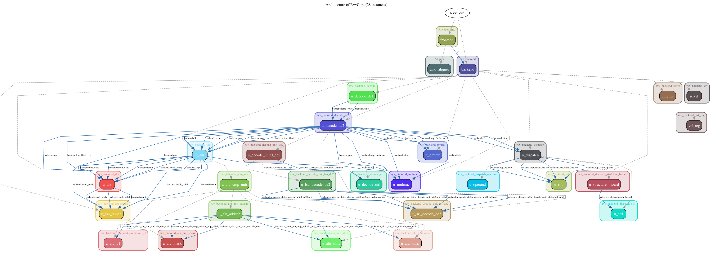
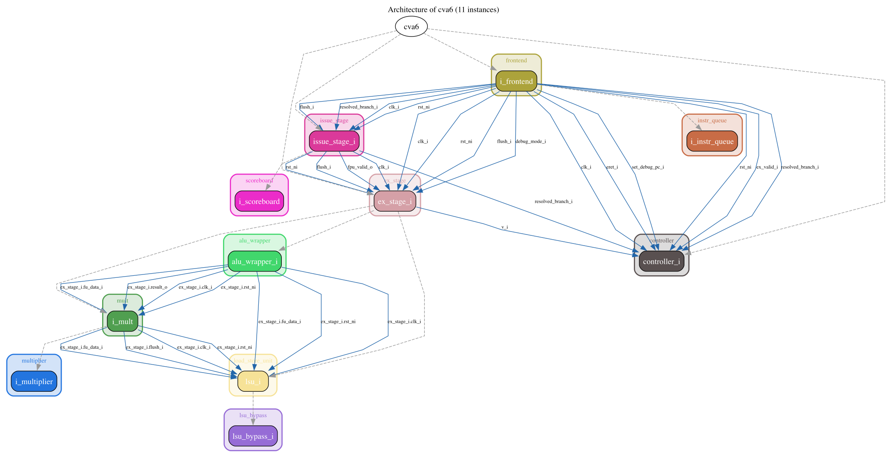
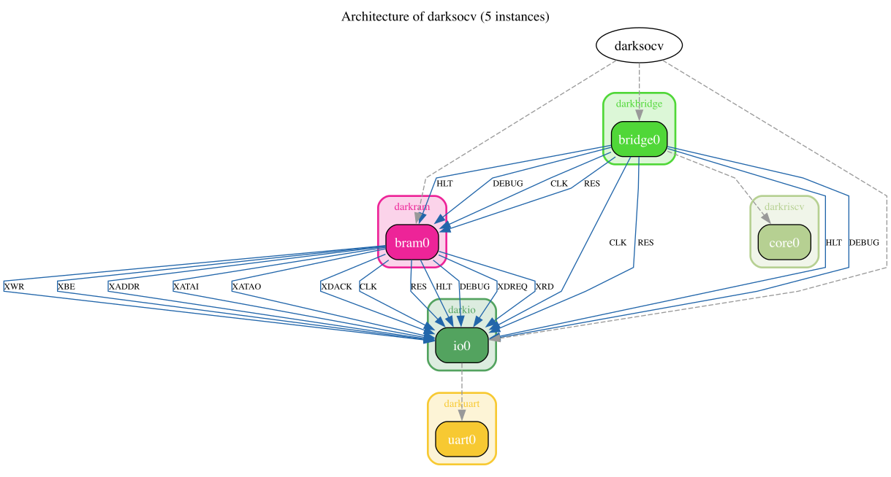

# sv_query - SystemVerilog 信号追踪查询引擎

**让验证工程师直接问"这个信号谁驱动的"，而不是去读代码。**

> **在 5 个开源项目上验证过**: CoralNPU 28 inst / CVA6 31 ports / Vortex / SERV / darkriscv.
> 新成员入门? 从 [CONTRIBUTING.md](CONTRIBUTING.md) 开始 — 5 分钟跑起来 + 30 分钟懂架构 + 加第一个 feature.

[]()
[]()
[](LICENSE_MIT)
[](LICENSE)

---

## 为什么用 sv_query

- **位精确追踪**: 知道信号 `[3:0]` 从哪里来, 到哪里去 (位选拼接不混淆, 不合并冗余边)
- **穿透子模块**: 跨过 wrapper port passthrough, 追踪真实物理连接 (而不是看 instantiate 表面)
- **4 维分析 (L1-L4)**: module 抽取 + 端口连接 + 内部信号 + 可视化, 业界少见
- **协议自动识别**: 一键识别 AXI4 / TL-UL / AHB / APB / Wishbone (4 项置信度融合, 避免误判)
- **数据可信**: 底层 [pyslang](https://github.com/MikePopoloski/pyslang) 解析 AST, **不是正则匹配**
- **大型项目支持**: Verilator 风格 filelist (`+incdir+`, `-F`, `${VAR}`), CVA6 / OpenTitan 级别 (162+ prim modules)
- **架构可视化** ([`arch` 命令](docs/ARCH_VISUALIZATION.md)): 一键生成项目架构图, 含跨 module 端口连线
- **工业项目跑通**: picorv32, OpenTitan, CVA6, NaplesPU, pulp axi 全部 strict mode 跑通
- **2446 测试** (232 文件): 稳定可靠, 覆盖核心功能

---

## 5 分钟快速上手

### 1. 安装

**要求**: Python 3.11+, git, pip (推荐 23+).

#### 最简 (用 sv_query)

```bash
git clone https://github.com/fundou1081/sv_query.git
cd sv_query
pip install -e .                  # 自动装 core deps (networkx, typer, pyslang)
sv_query --help                   # 验证: 看到 19 个子命令
```

`pip install -e .` 会自动装好核心依赖, 不需要单独 `pip install -r requirements.txt` — 后者只是为了老工具 / CI 脚本使用.

#### 完整 (含测试 + lint)

```bash
pip install -e ".[dev]"          # 加 pytest, pytest-cov, pytest-asyncio, ruff
python -m pytest sim/tests/unit sim/tests/cli -q   # ~30s
ruff check src/ tools/           # lint
```

#### 可选: graphviz (SVG/PNG 渲染)

```bash
brew install graphviz            # macOS
sudo apt-get install graphviz    # Ubuntu / Debian
```

只用 `--format dot/mermaid` 不需要 graphviz; 只 `--format svg/png` 需装.

### 2. 准备一个 SV 文件

```systemverilog
// top.sv
module top(input clk, rst_n, input [7:0] data, output [7:0] result);
    logic [7:0] temp;
    always_ff @(posedge clk) begin
        if (!rst_n)
            temp <= 8'h0;
        else
            temp <= data;
    end
    assign result = temp;
endmodule
```

### 3. 查询信号驱动

```bash
sv_query trace fanin top.result -f top.sv

# 输出:
# === Drivers for top.result ===
# Source Signal | Condition | Source File
# --------------+-----------+------------
# top.temp | Always | top.sv:8
#         ↓ (via always_ff)
# top.clk | Rising Edge | top.sv:1
# top.rst_n | Active Low | top.sv:1
# Confidence: Certain
```

### 4. 加速重复查询 (可选)

```bash
# 第一次运行 (解析 AST)
sv_query trace fanin top.result -f top.sv

# 第二次运行 (使用缓存, 跳过重复解析)
# 自动检测 + 复用缓存
```

### 5. 查看模块架构 (L1)

```bash
# 一键生成项目架构图 (DOT 格式)
sv_query arch -f top.sv -t top --format dot -o top.dot
# 用 graphviz 渲染:
dot -Tpng top.dot -o top.png
```

---

## ⭐ 主要功能 vs 稳定功能 vs 实验性功能 (3-层 2026-07-04)

sv_query 21 个主命令**分 3 类**:

### ⭐ **主要功能 (Primary, 重点加强, 承诺稳定)** — 3 个 (v3 2026-07-04)
- `dataflow analyze A B` — 看 A→B 数据流 + cycle latency + async crossing
- `controlflow analyze <sig>` — 看 signal 的 if/case 条件
- `visualize graph / dataflow / pipeline` — 画 DOT/Mermaid/HTML 图 (3 子命令真稳, 2 子命令 `gap`/`module` 修中)
- (关联) `trace evidence <sig>` — 拿源码 1 秒

**真稳验证**: 13 tests + 7 真项目 (sync_fifo / darkriscv / OpenTitan prim_arbiter_tree / prim_fifo_sync / CVA6 ALU / two_flop_sync) 100% 准.

**承诺**: 持续投入, 任何 bug 立即修.

**深度 doc**: [`docs/PRIMARY_FEATURES.md`](docs/PRIMARY_FEATURES.md) + [`docs/DATAFLOW_CONTROLFLOW_USAGE.md`](docs/DATAFLOW_CONTROLFLOW_USAGE.md)

### ✅ **稳定功能 (Stable, 真能用, 不主推)** — 12 个
- `stats` / `search` — 简单查询
- `arch show` — L1+L2 模块图
- `trace fanin / fanout / impact` — 信号追踪 (跟 `evidence` 一起)
- `protocol detect / show / list / semantics` — AXI/AHB/APB 检测
- `handshake scan / analyze / pair` — ready/valid 检测
- `backpressure analyze` — ready/valid 拓扑
- `sva extract / coverage / timing` — SVA 抽 + 覆盖
- `snapshot save / list / show / delete / compare` — graph 快照
- `diff compare` — 2 版本对比
- `fix timescale / report / imports / widths` — elaboration 修

**承诺**: 真稳可用, 但**不主推, 资源不投**. 偶尔修 bug.

### 🟡 **实验性功能 (Experimental, 探索性)** — 6 个标 [EXPERIMENTAL] (v3 2026-07-04 减 1)
- `cdc analyze` — 跨 clk (刚修算法, 没真 CDC 验证)
- `verify gap` — 高风险无 SVA (之前 traceback)
- `risk analyze` — graph-based heuristic (评分是启发式)
- `timing analyze` — critical path (没压力测试)
- `coverage generate` — 复杂 covergroup 可能生成不完整
- `backpressure deadlock` — 静态死锁检测, 算法不成熟

**不承诺稳定**: 可能 flaky / false positive / 挂掉. **不主推, 资源不投, 只 bug 修**.

**深度 doc**: [`docs/EXPERIMENTAL_FEATURES.md`](docs/EXPERIMENTAL_FEATURES.md)

---

## 核心能力 (4 维 L1-L4)

sv_query 是少有的提供**完整 4 维分析**的开源 SV 工具, 大部分同类工具只支持单维度 (e.g. 只有 L1, 或只有 L3).

### L1: Module 抽取 — 看清项目骨架

```bash
sv_query visualize module -f top.sv -t top -d 2
# top → u_sub, u_xbar, u_demux, ...
```

### L2: 跨模块 trace — 穿透 wrapper 真实物理连接

```bash
sv_query trace fanin axi_xbar_intf.s_axi_awvalid --filelist=pulp_axi.f
# 跨过模块边界, 追到 leaf driver
```

### L3: 内部信号追踪 — 走完 always_ff + assign 链

```bash
sv_query trace fanin top.u_dff.q -f top.sv --max-depth=3
```

### L4: 可视化 — 一张图看尽数据流 + 风险 + 覆盖

```bash
# 信号图 (数据流 + 风险 + 覆盖状态)
sv_query visualize graph -f top.sv --dot /tmp/graph.dot --html /tmp/graph.html

# 项目架构图 (跨 module 端口连线) — 5 个开源项目验证
sv_query arch --filelist=project.f -t top --summary
```

### 实际生成的效果 (5 个开源项目验证)

**Google CoralNPU** (28 instances, 4 层 hierarchy, 31 port connections — 2025 最新 RISC-V RVV NPU):



**CVA6 / Ariane** (11 instances, 3 层, 31 port connections — ETH Zurich 工业 RISC-V CPU):



**darkriscv** (5 instances, 2 层 — 极简 RISC-V SoC):



更多 (Vortex / SERV) + 用法 → [docs/ARCH_VISUALIZATION.md](docs/ARCH_VISUALIZATION.md)

---

## 用户场景

15 个常见工程问题, 一行命令直接答:

### 场景 1: 找不到信号是谁驱动的

```bash
sv_query trace fanin top.result -f "**/*.sv"
```

### 场景 2: 改了信号, 影响下游哪些逻辑

```bash
sv_query trace impact top.data -f "**/*.sv"
```

### 场景 3: 数据从 A 到 B 经过哪些路径

```bash
sv_query dataflow top.data_in top.fifo.wr_data -f "**/*.sv"
```

### 场景 4: 约束调用哪个父类

```bash
sv_query controlflow transaction.c_data -f "**/*.sv"
```

### 场景 5: RTL 仿真失败, 快速定位影响范围

```bash
# 哪些 input port 影响 data_reg
sv_query trace fanin data_reg -f "**/*.sv" --max-depth=5
# 它影响哪些 output port
sv_query trace fanout data_reg -f "**/*.sv" --max-depth=5
```

### 场景 6: 自动生成 covergroup (从 RTL 信号)

```bash
sv_query coverage generate -f top.sv -s data_o
# 5 种输出格式: covergroup, JSON, mermaid, ...
```

### 场景 7: UVM Testbench 静态结构提取

```bash
sv_query extract uvm -f my_test.sv
# 提取: uvm_test, uvm_env, uvm_agent, uvm_sequencer, ...
```

### 场景 8: Bus 协议自动识别

```bash
sv_query protocol detect -f uart.sv
# 自动识别: AXI4 / TL-UL / AHB / APB / Wishbone / Stream
# 4 项置信度融合 (name + structural + pattern + handshake)
```

### 场景 9: 自动修复 elaboration 错误

```bash
sv_query fix timescale -f "**/*.sv"      # 补 `timescale
sv_query fix imports -f "**/*.sv"        # 找 UndeclaredIdentifier 来源
sv_query fix widths -f top.sv            # 解析 typedef 真实位宽
```

### 场景 10: 看模块架构

```bash
# 单文件
sv_query arch -f top.sv -t top --summary

# 工业项目 (CoralNPU 28 inst / CVA6 31 ports)
sv_query arch --filelist=project.f -t top -d 10 --with-ports
```

### 场景 11: SVA 分析 (自动提取 properties / assertions)

```bash
sv_query sva extract -f top.sv
sv_query sva coverage -f top.sv
sv_query sva timing -f top.sv
```

### 场景 12: 时序关键路径

```bash
sv_query timing analyze -f top.sv
# 检测: register depth, DAG longest path, SCC
```

### 场景 13: CDC 检测

```bash
sv_query cdc analyze -f top.sv
# 跨时钟域路径
```

### 场景 14: 验证缺口检测 (SVA / Coverage 漏检)

```bash
sv_query verify gap -f top.sv
sv_query coverage gap -f top.sv --json
```

### 场景 15: 风险评分

```bash
sv_query risk analyze -f top.sv
# 评分: 时序深度 × fanout × 控制复杂度
```

更多细节 + 输出 → [docs/USER_GUIDE.md](docs/USER_GUIDE.md)

---

## CLI 命令参考 (摘要)

| 命令 | 用途 |
|------|------|
| `trace` | 信号驱动 (fanin) / 负载 (fanout) / 影响 (impact) |
| `stats` | 图统计 + 扇出排行榜 |
| `risk` | 风险评分 |
| `cdc` | 跨时钟域检测 |
| `sva` | SVA 提取 + 覆盖 + 时序 |
| `timing` | 关键路径分析 |
| `verify` | 验证缺口 |
| `coverage` | Covergroup 生成 + 缺口 |
| `dataflow` | 数据流路径分析 |
| `controlflow` | 控制流条件分析 |
| `protocol` | Bus 协议自动识别 |
| `visualize` | 信号图 (graph / dataflow / pipeline) |
| `arch` | 项目架构图 |
| `extract` | UVM Testbench 静态结构 |
| `fix` | 自动修复 elaboration 错误 |
| `snapshot` | Snapshot 管理 (graph diff) |
| `diff` | 比较两个版本 |

完整参数 → 跑 `sv_query <command> --help` 或 [docs/USER_GUIDE.md#cli-使用](docs/USER_GUIDE.md#cli-使用)

---

## Python API

```python
from trace.unified_tracer import UnifiedTracer

# 初始化
tracer = UnifiedTracer(file=Path("top.sv"), strict=False)
tracer.build_graph()

# 查询
drivers = tracer._signal_tracer._collect_all_drivers("top.result", max_depth=3)
loads = tracer._signal_tracer._collect_all_loads("top.result", max_depth=3)

# 拿 graph
g = tracer.get_signal_graph()
for node in g.nodes():
    print(f"node: {node.name}, type={node.kind}")
```

3 行 = 拿到完整信号图. `_build_tracer` 是 sv_query 统一入口, 所有 CLI 都用它.

详细 API → [docs/USER_GUIDE.md#python-api](docs/USER_GUIDE.md#python-api)

---

## 项目结构

```
sv_query/
├── run_cli.py              # 开发用 wrapper (也用 pip install -e . 装)
├── src/                    # 核心代码 (~26K 行)
│   ├── trace/              # 4 维分析 (L1-L4)
│   │   ├── unified_tracer.py
│   │   ├── core/           # compiler, graph, analyzer
│   │   ├── cli/commands/   # 17 个 CLI 子命令
│   │   └── _pyslang_compat.py
│   ├── cli/                # typer app + 共享 helper
│   └── applications/       # bus, cpu, operator (应用层模块)
├── tools/                  # 独立工具 (benchmark, fix, coverage_gen)
├── sim/tests/              # 2446 测试 (232 文件)
│   ├── unit/               # 1277 tests (单文件, 1-2s)
│   ├── cli/                # 76 tests (CLI 端到端, 5-10s)
│   ├── integration/        # 385 tests (跨模块 + 工业项目, 5min)
│   └── regression/         # 708 tests (大型项目, 15min)
├── docs/                   # 设计文档 (100+ 文件)
│   ├── INDEX.md            # 文档导航
│   ├── USER_GUIDE.md       # 用户使用
│   ├── ARCH_VISUALIZATION.md  # arch + 可视化
│   ├── OPENTITAN_HOWTO.md  # OpenTitan 大项目
│   ├── NAPLESPU_HOWTO.md   # NaplesPU
│   ├── PYSLANG_MEMORY_ISSUE.md  # 8GB MBA OOM
│   ├── PYSLANG_COMPAT.md   # pyslang 10/11 兼容
│   └── ...
├── examples/               # 综合案例脚本
├── config/protocols/       # AXI4 / TL-UL / AHB / APB / Wishbone YAML
└── .github/workflows/      # CI (tests + benchmark + coverage-gen)
```

---

## 依赖

| 类别 | 包 | 必需 | 备注 |
|------|-----|------|------|
| 核心 | `networkx>=3.0` | ✅ | pip 自动装 |
| 核心 | `typer>=0.9` | ✅ | pip 自动装 |
| 核心 | `pyslang>=10.0.0,<12.0.0` | ✅ | pip 自动装 (v10/v11 都支持) |
| 测试 | `pytest`, `pytest-cov`, `pytest-asyncio`, `ruff` | ❌ | `.[dev]` 自动装 |
| binary | `graphviz` | ❌ | 只 `--format svg/png` 需要 |
| 源码 | 工业项目 (PicoRV32, OpenTitan, CVA6, pulp axi) | ❌ | 不装 → 测试自动 skip |

> ⚠️ **入坑提醒 (2026-07-02)**: 之前 `pip install -e .` 报 `tool.setuptools must not contain {'package_dir'} properties`. 修好了. 如果你看到错, 重装: `pip install -e . --force-reinstall`.

---

## 参与贡献

1. Fork 并克隆仓库
2. 安装开发依赖: `pip install -e ".[dev]"`
3. 运行测试: `pytest sim/tests/ -v`
4. 提交前确保所有测试通过

详细开发流程 → [CONTRIBUTING.md](CONTRIBUTING.md)

---

## 许可

双许可:

- **MIT License** ([LICENSE_MIT](LICENSE_MIT)) - 推荐用于个人/商业项目
- **Apache License 2.0** ([LICENSE](LICENSE)) - 适合需要专利授权的项目

你可以选择任一许可来使用本项目.

---

## 链接

- 📚 [文档中心](docs/INDEX.md)
- 🐛 [问题追踪](https://github.com/fundou1081/sv_query/issues)
- 💻 [GitHub 仓库](https://github.com/fundou1081/sv_query)
- 📋 [更新日志](CHANGELOG.md)
