# sv_query — SystemVerilog 信号追踪查询引擎

**让验证工程师直接问"这个信号谁驱动的"，而不是去读代码。**

> 3071 测试 (非 opensource 主回归) | Python 3.11+ | pyslang 语义 AST | NetworkX graph | 真实项目验证

> 更新日期: 2026-09-05

---

## 为什么用 sv_query

- **位精确追踪**: `SignalSource` 结构化存储 bit_range + op + casts，知道信号 `[7:0]` 确切来源；位对位跨模块贯通 (顶层位查询 == 模块内位查询)
- **穿透子模块**: 跨 wrapper port passthrough + bus 位桥（同构直连 / 切片偏移 .y(y[7:4])），追踪真实物理连接
- **数据可信**: [pyslang](https://github.com/MikePopoloski/pyslang) 语义 AST，不是正则匹配；无 string fallback（纪律：失败显式可见，不静默出假数据）
- **真实项目验证**: aes / cordic / serv / verilog-axi 抽查 + CVA6 core strict 编译 (本机 `~/my_dv_proj/`)，见下方准确性声明
- **架构可视化**: `arch show` 一键生成项目架构图 (DOT/Mermaid/HTML/summary)
- **数据与渲染解耦**: VizData 统一可视化数据层

### 📜 准确性声明 (Accuracy Claim)

"图是否 = 代码的准确映射？" 的答案按层声明、可核查 — 详见
[`docs/architecture/signal_graph_accuracy_audit.md`](docs/architecture/signal_graph_accuracy_audit.md)：

| 层 | 承诺 | 状态 |
|---|---|---|
| **L1 结构层** (节点/边存在性) | 实例路径、端口连接、驱动不缺失、不造假节点 | ✅ 已验证设计域内 (假节点/静默丢连接/解码崩溃均已修, 测试锁定) |
| **L2 查询层** (fanin/驱动答案) | 查询结果正确 | ✅ 限建模粒度语义内 (位级贯通 / 端口停靠 / 时钟·控制信号排除) |
| **L3 深层语义层** (多驱动归属/共享合并) | 归属单点语义 | 🕐 边界已澄清 (inout/interface = 静态可能源集合); gate strength / SVA 消歧重构 = 暂缓有触发条件 |

> 反例表 7 项 → 全闭环或暂缓。**不能无限制说"一定准确"**：语义域外 (SVA/inline)、语料非穷举、上游 pyslang 边界 — 每处不准/不全都有文档登记 + 失败可见。

---

## 5 分钟快速上手

```bash
git clone https://github.com/fundou1081/sv_query.git
cd sv_query
pip install -e .
sv_query --help
```

### 查询信号驱动

```bash
# 看谁驱动了 result
sv_query trace fanin top.result -f top.sv

# 画信号关系图
sv_query visualize graph -f top.sv

# 画数据流图 (控制边=虚线，数据边=实线)
sv_query visualize dataflow -f top.sv

# 看模块架构
sv_query arch show -f top.sv -t top --summary
```

### 可选: graphviz

```bash
brew install graphviz  # macOS
# 生成 PNG:
sv_query visualize graph -f top.sv --dot /tmp/g.dot && dot -Tpng /tmp/g.dot -o /tmp/g.png
```

---

## 数据流可视化 (Dataflow Visualization)

`visualize dataflow` 将 SystemVerilog 的 `assign` 和 `always` 逻辑自动渲染为 ELK.js 数据流图。

### 设计理念

- **双层渲染引擎**: 纯组合逻辑走 ExpressionTree 路径（ELK layered layout），时序/条件逻辑走 compound graph 路径（case/if branch 范围框）
- **条件分离**: 三元运算符 `? :` 的条件信号用**灰色虚线**标注，数据信号用实线
- **嵌套支持**: 嵌套三元 `(sel_b ? a : b)` 自动展开为子节点，标签 `?: (sel_b)`
- **零配置**: 不需要 graphviz，内部集成 ELK.js + rsvg-convert 直接出 SVG/PNG

### 快速使用

```bash
# 数据流图（运算表达式）
sv_query visualize dataflow -f top.sv

# 指定模块
sv_query visualize dataflow -f top.sv -m counter

# 导出 SVG（--dot 参数复用为 SVG 输出，兼容旧接口）
sv_query visualize dataflow -f top.sv --dot output.svg
```

### 效果展示

**函数调用 + 运算** (`assign y = add_sat(a,b); assign z = (a*b)+c`)

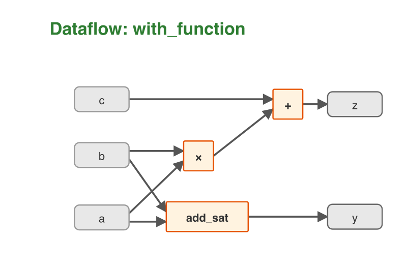

节点: `a,b,c` → `×` `add_sat` `+` → `z,y`

**三元运算符** (`assign y = sel_a ? (sel_b ? a : b) : c`)

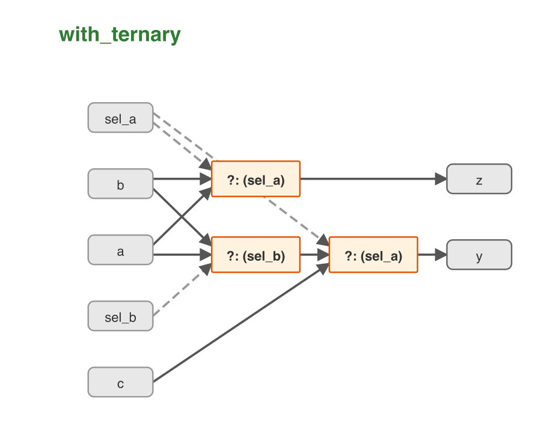

`?: (sel_a)` / `?: (sel_b)` — 条件边=灰色虚线，数据边=实线

**case 多路选择** (`always @(*) case(sel) ...`)

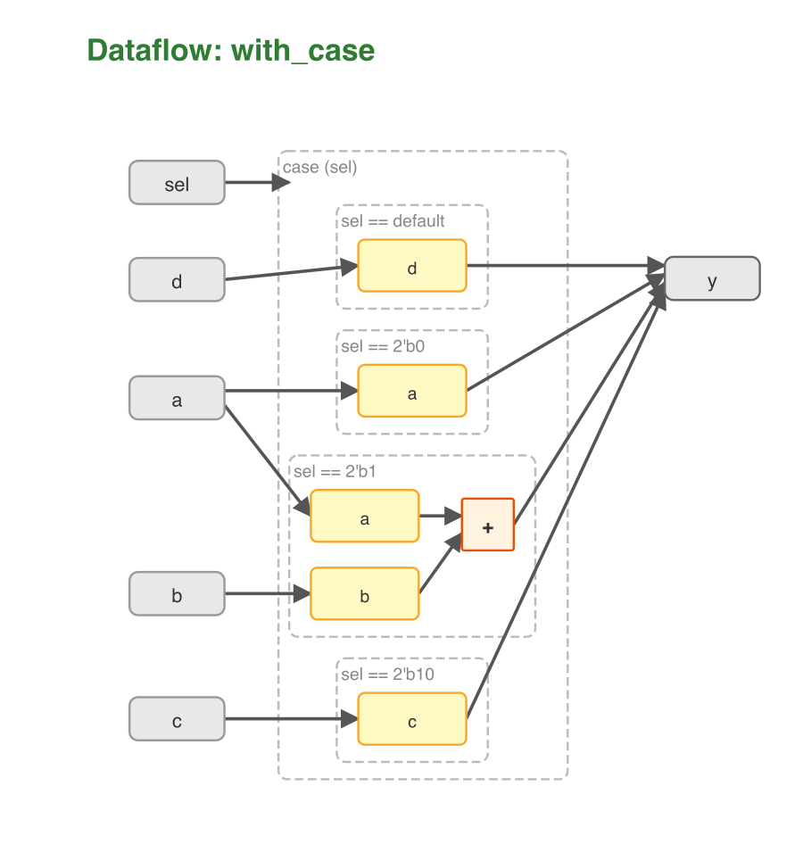

`case (sel)` 紫色实线框 + 绿色虚线分支标签

**if-else 条件分支** (`always @(posedge clk) if(!rst_n) ... else if(a>10) ...`)

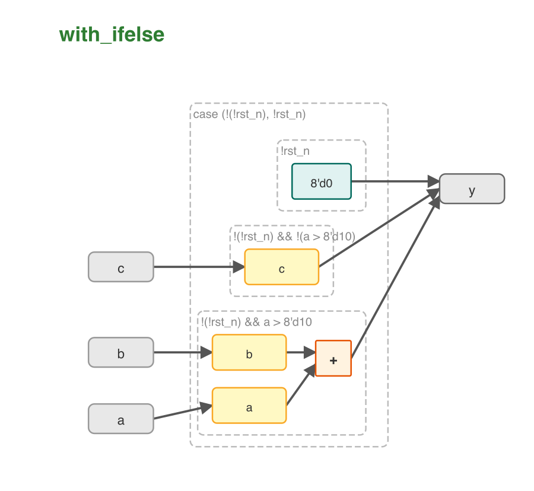

复合条件展开，分支内嵌操作符

### 32 个 Golden Case 数据流图全景（V16.6+）

下面这张 4×8 grid 包含 **32 个 `golden_dataflow_*.sv` fixture** 的全部数据流可视化输出（V16.6 修复后），按 case 编号 1 → 31 排序（case12 含 2 张：complex + mixed，故 32 张图覆盖 31 个编号）。

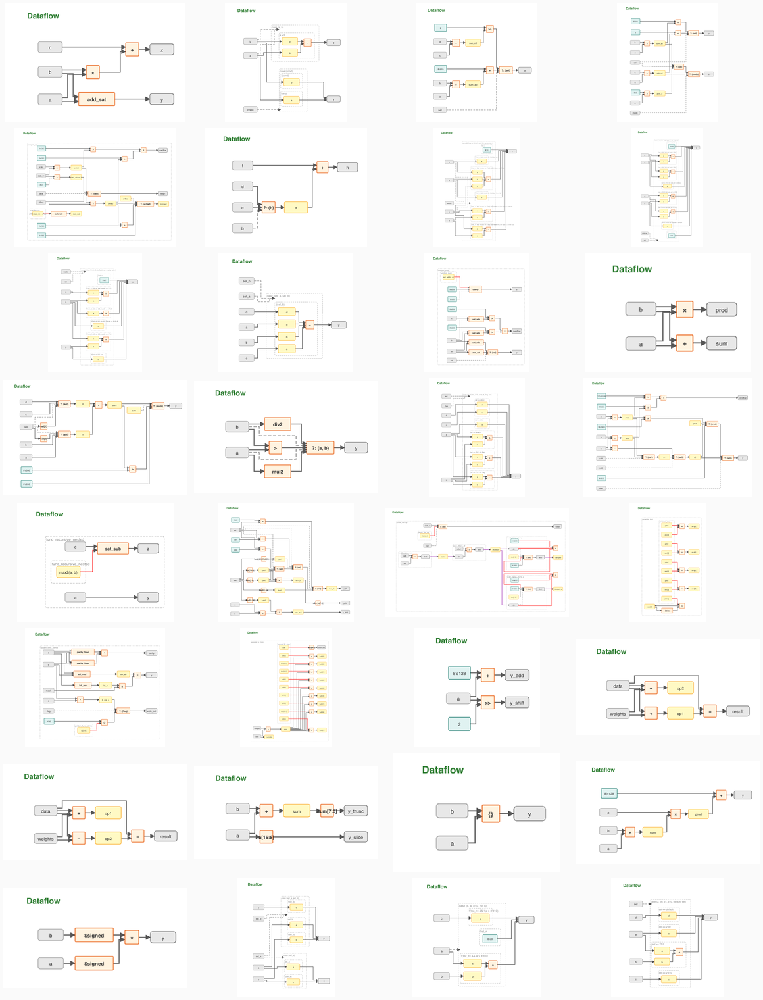

涵盖的场景类型：
- **基础算子** (case1-3)：算术、切片、拼接
- **复杂运算** (case4-6)：concat、signed、$clog2
- **三元 + case + if-else** (case7-20)：各种嵌套分支与多路选择
- **generate 循环 + case** (case21-31)：生成块、函数复用、数组索引
- **层级设计** (case26)：4 个 instance 各自的 cluster 框，顶层 cluster_target_top 作为最大外层框

### V16 Plan 重大改进（V16.1 → V16.6）

V16 Plan 完整故事线见 [`docs/VIZ_V16_PLAN.md`](docs/VIZ_V16_PLAN.md)，6 个 phase 解决的问题：

#### V16.1 — const / sig 节点归位 + 紫色 stroke 修复 (commit `73b16ec`)

const 节点从"永远在顶层"修复为按 `parent_module` 归位到对应 instance cluster。

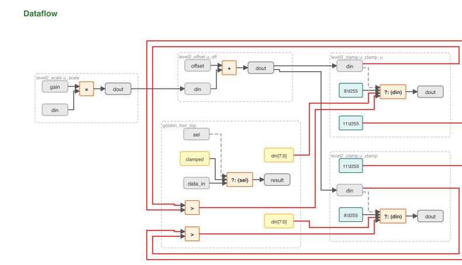

#### V16.2 — 4 个 wire 节点归位 cluster_target_top (commit `cf208fb`)

`sig_<name>_wire` 节点（`render_tree` 的递归匹配结果）从散落各处归位到顶层 cluster_target_top。

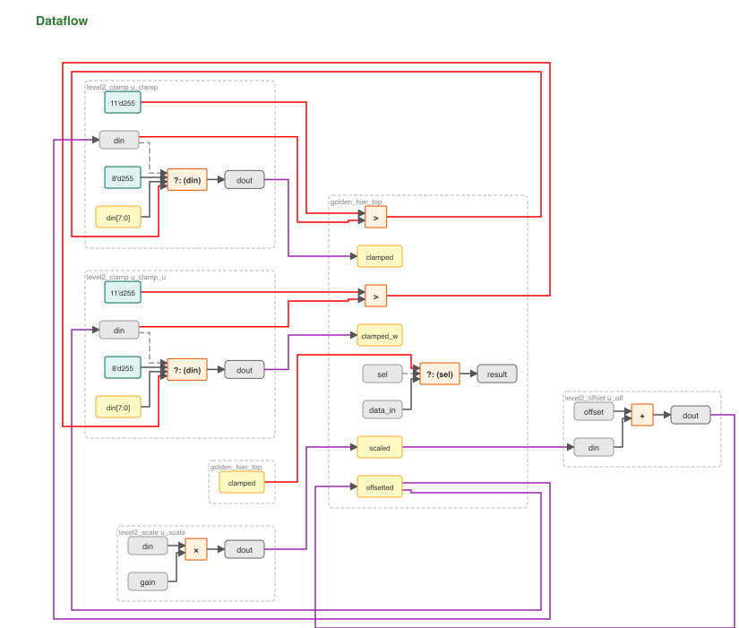

#### V16.3 — A3 orphan 检测用 layout 数据 + 32-case 全 PASS (commit `5df3736`)

`checker.py` A3 规则从用 `viz.nodes` 切换为用 ELK `layout.json`，orphan 检测基于真实渲染位置。


#### V16.3.2 — VizData emit const 节点 (commit `382d5d6`)

`viz_data_builder._walk_collect_const()` 从 `graph._expr_trees` 递归找 `op='Const'` 节点生成 VizNode，让 const 在 viz.json 里可验证。

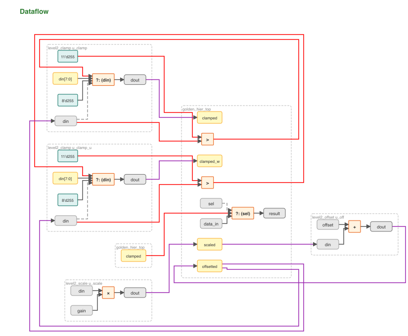

#### V16.4 — 嵌套 cluster：top 作为最大框，子 instance cluster 嵌套其中 (commit `14a6a91`)

`_wrap_into_clusters` 改写：子 instance cluster 嵌套到 `cluster_target_top.children` 而不是 root 的 children。

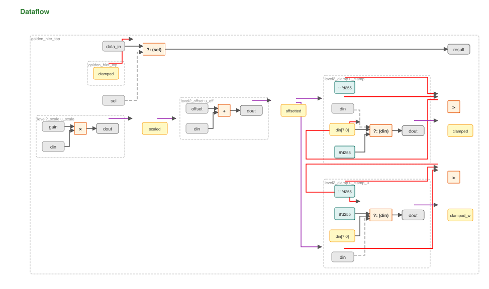

#### V16.5 — 线位置修复：用 ELK container 字段决定 cluster offset (commit `e08c64c`)

`_render_svg_direct.walk_e()` 用 `e.get('container')` 取 cluster offset，修复 case26 29 条边端点错位。

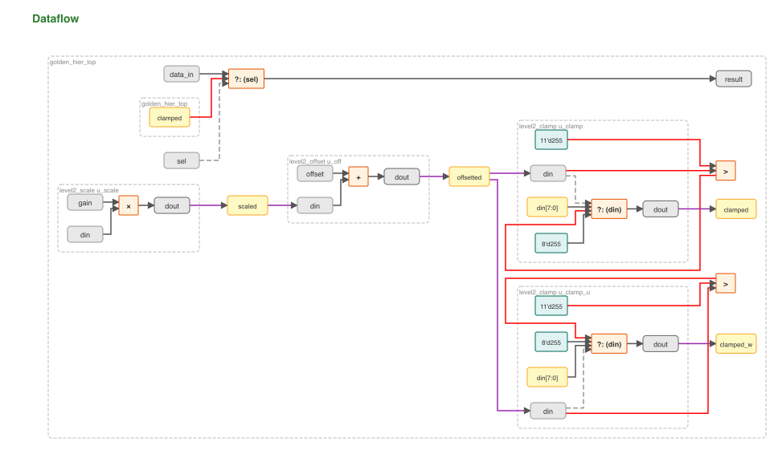

#### V16.6 — 顶层 const cluster_id 归位（消除 CROSS_TOP 红线）(commit `c32e7ac`)

`elk_bridge.py` L443-448 新增分支：`parent_module == target_mod` 时 const 节点归到 `cluster_target_top` 而非创建嵌套子框 `cluster_<mod>`，消除 case2 等单层 module 的误判红线。

**case2 (with_const) 修复前 vs 修复后**：

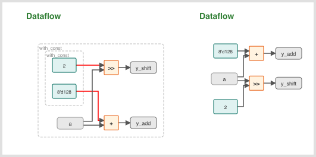

- 修复前：2 条红色 CROSS_TOP 边（const_n_8_d128_4 → op_+ 和 const_n_2_6 → op_>>）
- 修复后：0 条红线，所有 const 节点归位到 cluster_target_top 顶层

**V16.6 修复源码**（`src/trace/core/graph/viz/elk_bridge.py` L441-457）：

```python
_target_mod = (viz.meta or {}).get('target_module', '') if viz is not None else ''
_cluster_id = parent_module
# V16 Plan Phase 1.5: 顶层 const (parent_module == target_mod) 
# 应当归到 cluster_target_top (cluster_id=''), 而不是创建嵌套子框
if _target_mod and _cluster_id == _target_mod:
    _cluster_id = ''  # 顶层, 归 cluster_target_top
elif _target_mod and _cluster_id.startswith(_target_mod + '.'):
    _cluster_id = _cluster_id[len(_target_mod) + 1:]
_meta = {'kind': 'const', 'cluster_id': _cluster_id or ''}
```

### V16.6 完整验证

- ✅ **32-case strict regression: 32 / 32 PASS**（V16.1 → V16.6 零回归）
- ✅ **case2 红线消失**：0 red edges (修复前 2 条)
- ✅ **case26 const 归位保持不变**：`u_clamp`/`u_clamp_u`/`u_off`/`u_scale` 4 个 cluster 仍正确归位
- ✅ **嵌套 cluster 结构保持**：V16.4 引入的 cluster_target_top 嵌套子框结构不受影响

### 生成过程（在 `~/my_dv_proj/sv_query` 目录下）

```bash
# 1. 跑 32 case strict 回归 + dump 每个 case 的 SVG/PNG/viz.json/elk.json/layout.json
PYTHONPATH=src python3 -m sim.tests.manual.regress_golden_mini \
    --level strict --quiet \
    --dump /tmp/viz_32_full
# → PASSED: 32 / 32

# 2. SVG → PNG 批量转换
mkdir -p /tmp/v16_32cases
for svg in /tmp/viz_32_full/*.svg; do
    name=$(basename "$svg" .svg)
    rsvg-convert -f png -o "/tmp/v16_32cases/${name}.png" "$svg"
done

# 3. 拼成 4×8 grid 全景图 (1.18 MB)
montage /tmp/v16_32cases/*.png \
    -tile 4x8 \
    -geometry '280x180+5+5' \
    -background '#fafafa' \
    /tmp/v16_32cases_grid.png
```

**关键产物**（全部在 `docs/images/`）：
- `v16_6_32cases_grid.png` (1.18 MB, 4×8 grid, V16.6 修复后 32 case 全景)
- `case1_op.png` 到 `case31_generate_case.png` (32 个单图)
- `case2_const.png` (V16.6 修复后 case2 渲染)
- `case2_v16_6_red_line_fix.png` (case2 修复前后对比)
- `case26_v16_p1_const_cluster.png` ~ `case26_v16_p5_line_fix.png` (V16 6 phase 进度记录)

### 实现细节

| 路径 | 条件 | 渲染方式 |
|------|------|---------|
| ExpressionTree | 有 `assign` / 组合逻辑 | `expr_trees_to_elk()` → ELK layered layout |
| Compound fallback | 纯时序 / case / if | `viz_to_elk()` → ELK compound graph |
| Nested clusters | target_mod 有子 instance | `_wrap_into_clusters()` 嵌套到 cluster_target_top |
| Const emission | expr tree 含 Const 节点 | `_walk_collect_const()` → VizNode (kind=CONST) |
| Stroke colors | dataflow/condition/cross-instance/cross-top | `#555` 实线 / `#989` 虚线 / `#9C27B0` 紫色 / `red` 红色 |

- **三目展开**: `ExpressionTree._build_ternary()` 从 pyslang AST `ConditionalPredicate` 提取条件+真/假分支
- **边颜色**: dataflow 实线 `#555` / condition_select 虚线 `#989` (stroke-dasharray 6,3) / 跨 instance 紫色 `#9C27B0` / CROSS_TOP 红色 `red`
- **节点类型**: port_in/port_out (灰色圆角) · op (橙色方框) · signal (黄色圆角) · const (青色圆角) · cluster (浅蓝边框 solid, target 虚线)

---

## 功能分层 (3-tier)

### ⭐ 主要功能 (Primary) — 重点投入

| 命令 | 价值 |
|------|------|
| `dataflow analyze A B` | A→B 数据流 + cycle latency |
| `controlflow analyze A` | 看 signal 的 if/case 条件树 |
| `visualize graph/dataflow/pipeline` | 画 DOT 图 (V6.7 统一渲染) |

### ✅ 稳定功能 (Stable)

- `trace fanin/fanout/impact` — 信号追踪
- `arch show` — 架构图
- `stats/search` — 查询
- `sva extract/coverage/timing` — SVA
- `snapshot save/list/show/delete/compare` — 快照
- `diff compare` — 版本对比
- `protocol detect/show/semantics` — 总线协议

### 🟡 实验功能 (Experimental) — 以 `--help` 为准，不承诺稳定性

- `coverage generate/gap` / `verify gap`
- `fix timescale/report/imports/widths`

---

## CLI 命令参考

| 命令 | 用途 |
|------|------|
| `trace` | 信号驱动/负载/影响 |
| `visualize` | graph/dataflow/pipeline/chain/module/teach |
| `arch` | 架构图 |
| `dataflow` | 数据流路径分析 |
| `controlflow` | 控制流条件分析 |
| `stats/search` | 统计/搜索 |
| `sva/coverage/verify` | SVA 提取/覆盖率/验证 |
| `protocol/handshake` | 总线/握手协议 |
| `snapshot/diff` | 快照/版本对比 |
| `fix` | 自动修复 elaboration 错误 |
| `design` | 项目概述 |

完整 → `sv_query <command> --help`

---

## Python API

```python
from trace.unified_tracer import UnifiedTracer

# 1. 构建图
tracer = UnifiedTracer(sources={"top.sv": src}, strict=False)
tracer.trace_module("top")
graph = tracer.get_graph()

# 2. 查询信号驱动 (含 condition, clock, 位精确 source)
drivers = tracer.trace_fanin_detailed("top.result")
for d in drivers:
    print(f"{d.node.id} ← {d.expression}")
    if d.source:
        print(f"  bit:[{d.source.bit_start}:{d.source.bit_end}] op={d.source.op}")
    print(f"  when: {d.condition or 'always'}")

# 3. 导出可视化数据 (V6.7)
from trace.core.graph.viz import build_viz_data, VizBuildOptions, render_dot
viz = build_viz_data(graph, VizBuildOptions(include_edge_condition=True))
dot = render_dot(viz, {"title": "My Design"})    # DOT 字符串
data = viz.to_json()                               # JSON 纯数据
```

更多 → [CONTRIBUTING.md](CONTRIBUTING.md)

---

## 项目结构

```
sv_query/
├── src/trace/              # 核心 (~39K 行)
│   ├── unified_tracer.py   # 统一入口
│   ├── core/
│   │   ├── graph/
│   │   │   ├── models.py        # TraceNode/TraceEdge/SignalSource/DriverInfo
│   │   │   ├── viz/             # V6.7 VizData 统一可视化层
│   │   │   └── analyzer/        # dataflow/cdc/timing/pipeline/classifier
│   │   ├── driver_extractor.py  # Driver 提取 (2639 行)
│   │   ├── graph_builder.py     # 图构建器
│   │   └── visitors/            # AST Visitor (~10K 行)
│   └── cli/commands/            # 23 CLI 命令
├── sim/tests/              # 3071 测试 (非 opensource 主回归, 305+ 文件)
├── docs/                   # 文档
└── tools/                  # 独立工具
```

---

## 测试

```bash
pip install -e ".[dev]"

# 日常开发 — golden 测试 (纯 SV, 30s)
python -m pytest sim/tests/ -m golden -q

# 日常开发 — 跳过开源项目依赖 (~2min)
python -m pytest sim/tests/ -m "not opensource" -q

# 发布前 — 开源项目验证 (picorv32, darkriscv, OpenTitan...)
python -m pytest sim/tests/ -m opensource -v

# 全量
python -m pytest sim/tests/ -q
# 3071 tests (非 opensource 主回归, 2026-09-05 更新)
```

详见 [测试指南](docs/TESTING.md)

---

## 依赖

| 包 | 必需 |
|----|------|
| networkx>=3.0 | ✅ |
| typer>=0.9 | ✅ |
| pyslang>=10.0.0 | ✅ |
| graphviz | ❌ (只 PNG/SVG) |

---

## 相关文档

- [架构文档](docs/ARCHITECTURE.md)
- [准确性审计 + Accuracy Claim](docs/architecture/signal_graph_accuracy_audit.md)
- [实验性功能声明 (不承诺稳定)](docs/EXPERIMENTAL_FEATURES.md)
- [开发纪律](AGENTS.md) · [当前任务](CURRENT_TODO.md)
- [可视化设计规范](docs/VIZ_DESIGN_SPEC.md)
- [文档索引](docs/INDEX.md)
- [已知限制](docs/KNOWN_LIMITATIONS.md)

## 许可

MIT + Apache 2.0 双许可
