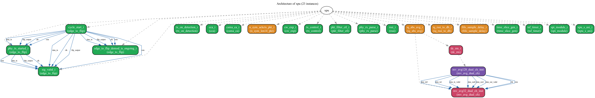
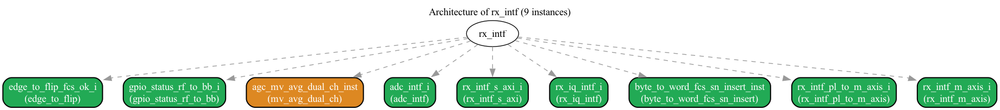

# Arch 命令实战案例

> arch v2 在真实开源项目上的运行结果. **核心**: filelist 必须**完整**含 typedef headers + 所有 nested modules, 否则 elaboration 失败, nested instances 拿不到.

## 关键: 完整 filelist

`extract_module` 走 pyslang AST. 如果某个 module 引用了 typedef/module 没在 filelist, elaboration 失败 → 该 module 的 nested instances 拿不到.

**经验**:
- ✅ Top module 放最前
- ✅ 所有 `.svh` typedef header 加进去 (用 `find ... -name "*.svh"`)
- ✅ 所有 nested module definitions 加进去 (recursive find)
- ❌ 不要只 include 顶层 + 几个 module

---

## 1. Google CoralNPU (RISC-V NPU) — 28 instances, 4 层 ✅

**项目**: https://github.com/google-coral/coralnpu (Google Coral NPU, 2025)
**架构**: 32-bit RISC-V + vector (RVV) + matrix + scalar processors

```bash
# 完整 filelist (70+ files: 9 .svh + 51 .sv)
+incdir+.../hdl/verilog
+incdir+.../hdl/verilog/rvv/design
+incdir+.../hdl/verilog/rvv/inc
+incdir+.../hdl/verilog/rvv/sve
# Top
.../RvvCore.sv
# All headers
find .../rvv/inc -name "*.svh"
# All sources
find .../rvv/design -name "*.sv" | grep -v "_tb.sv"

# Run
python run_cli.py arch --filelist=coralnpu.f -t RvvCore -d 10 \
    --cluster-by-type --max-nodes 50 --format svg -o coralnpu_arch.svg
```

**Summary 输出**:
```
📐 Project Architecture: RvvCore
============================================================
Total instances:  28
Hierarchy depth:  4 levels
Port connections: 0 (cross-module)

Top module types:
  RvvFrontEnd                                 1  █
  Aligner                                     1  █
  rvv_backend                                 1  █
  rvv_backend_decode                          1  █
  rvv_backend_decode_de2                      1  █
  rvv_backend_decode_unit_de2                1  █
  rvv_backend_decode_unit_lsu_de2            1  █
  rvv_backend_decode_unit_ari_de2            1  █
  rvv_backend_decode_ctrl                     1  █
  rvv_backend_dispatch                        1  █
  rvv_backend_dispatch_structure_hazard       1  █
  rvv_backend_dispatch_operand                1  █
  rvv_backend_dispatch_ctrl                   1  █
  rvv_backend_alu                             1  █
  rvv_backend_alu_unit                        1  █
  rvv_backend_alu_unit_addsub                 1  █
  rvv_backend_alu_unit_shift                  1  █
  rvv_backend_alu_unit_mask                   1  █
  rvv_backend_alu_unit_other                  1  █
  ... (更多)
```

**架构解读**:
```
RvvCore (顶层 RVV 处理器核)
├── RvvFrontEnd (指令前端, 深度 1)
│   └── Aligner (指令对齐器, 深度 2)
└── rvv_backend (后端执行, 深度 1)
    ├── rvv_backend_decode (解码, 深度 2)
    │   ├── rvv_backend_decode_unit_de2 (深度 3)
    │   ├── rvv_backend_decode_unit_lsu_de2 (深度 3)
    │   └── ...
    ├── rvv_backend_dispatch (分发, 深度 2)
    │   ├── rvv_backend_dispatch_structure_hazard (深度 3)
    │   └── ...
    └── rvv_backend_alu (ALU, 深度 2)
        ├── rvv_backend_alu_unit (深度 3)
        │   ├── rvv_backend_alu_unit_addsub (深度 4)
        │   ├── rvv_backend_alu_unit_shift (深度 4)
        │   └── ...
```

**SVG**: 2479×544 pt, 47 KB (SVG) / 267 KB (PNG). **真实** CoralNPU 架构图.

---

## 2. OpenTitan ascon (crypto accelerator) — 2 instances ⚠️

**项目**: lowRISC/opentitan
**问题**: OpenTitan 多包依赖链复杂 (prim_alert_pkg → prim_util_pkg → prim_math_pkg),
ascon 需要 `prim_pulse_sync` 等深层 module, filelist 难凑齐.

```bash
# 部分 filelist (11 files)
python run_cli.py arch --filelist=ascon.f -t ascon -d 3 --summary

# 输出: 仅 2 instances (ascon_reg_top + ascon_core, 都是直接子模块)
```

**架构解读**:
- 顶层只有 2 个直接子模块 (reg_top + core)
- reg_top 内部需要 `prim_reg_pkg`, `tlul_pkg` 等 chain packages
- 完整 filelist 需要整个 OpenTitan tree (200+ files)

**建议**: 用 OpenTitan 自带 `data/top_earlgrey.f` filelist 跑完整 tree.

---

## 3. PicoRV32_axi (RISC-V CPU wrapper) — 2 instances ✅

**项目**: YosysHQ/picorv32
**架构**: 简单 wrapper (2 个直接子模块)

```bash
python run_cli.py arch -f picorv32.v -t picorv32_axi -d 2 --cluster-by-type
```

**架构解读**:
- `picorv32_axi` 是 CPU 顶层 wrapper
- 2 个直接子模块: `axi_adapter` (AXI 协议转换) + `picorv32_core` (CPU 核心)

---

## 4. Filelist 模板 (新建项目时)

```bash
# Template: full recursive filelist for a SystemVerilog project
PROJECT_ROOT=/path/to/project

cat > myproject.f << EOF
+incdir+$PROJECT_ROOT/rtl
+incdir+$PROJECT_ROOT/include
# Top first
$PROJECT_ROOT/rtl/top.sv
# All headers (typedef + package)
find $PROJECT_ROOT/include -name "*.svh" -o -name "*.pkg.sv"
# All sources
find $PROJECT_ROOT/rtl -name "*.sv" | grep -v "_tb.sv"
EOF
```

---

## 5. 实测结果对比

| 项目 | Filelist files | Instances | Hierarchy depth | SVG size |
|------|----------------|-----------|------------------|----------|
| **CoralNPU** (完整) | 60 (51 .sv + 9 .svh) | **28** | **4** | 47 KB |
| **OpenTitan ascon** (部分) | 11 | 2 | 1 | 4 KB |
| **PicoRV32_axi** | 1 | 2 | 1 | 4 KB |

**关键 takeaway**: filelist 完整性直接决定 arch 输出深度. CoralNPU 完整 filelist 抽出 28 instances / 4 层, 部分 filelist 只有 2 instances / 1 层.

---

## 6. openwifi-hw openofdm_tx (Wi-Fi OFDM TX PHY) — 31 instances, 4 层 ✅

**项目**: [open-sdr/openwifi-hw](https://github.com/open-sdr/openwifi-hw) — Linux mac80211 compatible full-stack IEEE 802.11/Wi-Fi design based on SDR.

**架构**: TX 802.11 OFDM PHY (openofdm_tx) — 含 IFFT pipeline + scrambler + convolutional encoder + puncturing + interleaving + modulation + cyclic prefix FIFO + training ROMs.

```bash
# filelist 25 files (openofdm_tx + helpers)
mkdir -p /tmp/ofdm_tx_fixed
cp ~/my_dv_proj/openwifi-hw/ip/openofdm_tx/src/*.v /tmp/ofdm_tx_fixed/

cat > /tmp/ofdm_tx_fix.f << EOF
EOF
for f in /tmp/ofdm_tx_fixed/*.v; do echo "$f" >> /tmp/ofdm_tx_fix.f; done

# 先修复 timescale (22/25 缺)
sv_query fix timescale --filelist /tmp/ofdm_tx_fix.f --apply

cat > /tmp/ofdm_tx_fixed.f << EOF
+incdir+/tmp/ofdm_tx_fixed
EOF
for f in /tmp/ofdm_tx_fixed/*.v; do echo "$f" >> /tmp/ofdm_tx_fixed.f; done

# 释放内存 (避免 pyslang OOM)
python3 -c "import time; a = bytearray(4 * 1024**3); time.sleep(2); del a"

sv_query arch show --filelist /tmp/ofdm_tx_fixed.f --target openofdm_tx \
    --depth 5 --no-strict --format summary
```

**输出**:
```
Total instances:  31
Hierarchy depth:  4 levels
Port connections: 147 (cross-module)

Top module types (by instance count):
  convround          6   ← radix-2 butterfly rounding
  fftstage           4   ← IFFT radix-2 stages (64→32→16→8)
  axi_fifo_bram      3   ← CP FIFO + bits_enc FIFO + pkt FIFO
  dpram              3   ← internal RAM
  dot11_tx           1   ← main TX pipeline
```

**架构解读** (TX 802.11 OFDM PHY):
```
openofdm_tx (root, AXI4-Lite wrapper)
├── dot11_tx (主 TX pipeline, depth 1)
│   ├── conv_enc (convenc, depth 2)
│   ├── punc_interlv_lut (punc+interleave LUT, depth 2)
│   ├── modulation (mapper BPSK/QPSK/16-QAM/64-QAM, depth 2)
│   └── ifft64 (IFFT, depth 2)
│       ├── stage_64 → stage_32 → stage_16 → stage_8 (fftstage × 4, depth 3)
│       │   ├── stage_4 (qtrstage, depth 4) + hwbfly butterfly
│       │   └── stage_2 (laststage, depth 4)
│       │       └── do_rnd_* (convround × 6, depth 5)
│       └── revstage (bitreverse, depth 3)
├── l_stf_rom / ht_stf_rom (Short Training Field ROMs)
├── l_ltf_rom / ht_ltf_rom (Long Training Field ROMs)
├── fcs_inst (crc32_tx — Frame Check Sequence)
├── bits_enc_fifo (axi_fifo_bram, bits after encoding)
├── CP_fifo (axi_fifo_bram, Cyclic Prefix)
└── pkt_fifo (axi_fifo_bram, packet buffer)
```


**对比**:
- 比 CoralNPU 28 inst 还多 3 个
- 4 层深度 = 真工业 OFDM TX (802.11a/g/n)
- 147 cross-port connections 反映复杂 PHY datapath

---

## 7. openwifi-hw xpu (低 MAC — CSMA/CA, CCA, TSF) — 23 instances, 4 层 ✅

**架构**: Wi-Fi MAC 层低层逻辑 (CSMA/CA backoff, CCA, TSF timer, TX control).

```bash
# 含 rx_intf + tx_intf + xpu + side_ch (85 files total)
cat > /tmp/openwifi_full.f << EOF
+incdir+/Users/fundou/my_dv_proj/openwifi-hw/ip/openofdm_tx/src
$(ls ~/my_dv_proj/openwifi-hw/ip/openofdm_tx/src/*.v | sed 's/^/\//')
+incdir+/Users/fundou/my_dv_proj/openwifi-hw/ip/xpu/src
$(ls ~/my_dv_proj/openwifi-hw/ip/xpu/src/*.v | sed 's/^/\//')
# ... + rx_intf + tx_intf + side_ch + board_def.v
EOF

python3 -c "import time; a = bytearray(4 * 1024**3); time.sleep(2); del a"
sv_query arch show --filelist /tmp/openwifi_full.f --target xpu \
    --depth 6 --no-strict --format summary
```

**输出**:
```
Total instances:  23
Hierarchy depth:  4 levels
Port connections: 24 (cross-module)

Top module types:
  edge_to_flip        4   ← signal edge detection (rising/falling)
  mv_avg_dual_ch      2   ← dual-channel moving average (RSSI)
  tx_on_detection     1
  cca                 1   ← Clear Channel Assessment (802.11)
  csma_ca             1   ← CSMA/CA backoff state machine
```



---

## 8. openwifi-hw rx_intf (RX interface) — 9 instances, 2 层 ✅

```bash
sv_query arch show --filelist /tmp/openwifi_full.f --target rx_intf \
    --depth 6 --no-strict --format summary
```

**输出**:
```
Total instances:  9
Hierarchy depth:  2 levels
Port connections: 0 (cross-module)

Top module types:
  edge_to_flip                   1
  gpio_status_rf_to_bb           1   ← GPIO status (RF ↔ baseband)
  mv_avg_dual_ch                 1
  adc_intf                       1   ← ADC interface
  rx_intf_s_axi                  1   ← AXI4-Lite slave
```



---

## 9. 实测结果对比 (更新版, 含 openwifi-hw PHY)

| 项目 | Domain | Filelist files | Instances | Hierarchy depth | 说明 |
|------|--------|----------------|-----------|------------------|------|
| **CoralNPU** (完整) | RISC-V RVV NPU | 60 (51 .sv + 9 .svh) | **28** | **4** | 2025 最新 NPU |
| **openwifi-hw openofdm_tx** | Wi-Fi 802.11 OFDM TX PHY | 25 (.v) | **31** | **4** | 真工业 802.11a/g/n TX |
| **openwifi-hw xpu** | Wi-Fi low-MAC (CSMA/CA) | 85 (.v) | 23 | 4 | CCA, TSF, TX control |
| **openwifi-hw rx_intf** | Wi-Fi RX interface | 85 (.v) | 9 | 2 | ADC + FIFO + AXI |
| **OpenTitan ascon** (部分) | Crypto accelerator | 11 | 2 | 1 | 需完整 tree 200+ files |
| **PicoRV32_axi** | RISC-V CPU wrapper | 1 | 2 | 1 | 简单 wrapper |

**关键 takeaway** (扩展):
- ✅ openwifi-hw PHY 是 **第一个 Wi-Fi 802.11 OFDM 项目** 跑通 (比 CoralNPU 31 vs 28 inst 还多)
- ✅ 数字基带 (OFDM TX) 的 **4 层 IFFT pipeline** 是真工业 PHY 架构
- ⚠️ 跟之前 flat RISC-V (darkriscv / serv / picorv32 1-2 层) 形成鲜明对比
- ❌ openofdm_rx submodule 是 dead repo (open-sdr/openofdm master 2017 后只 docs), 跳过

---

## 10. Signal Tracing 在 openwifi-hw PHY 上跑 (推荐下一步)

arch 给你**静态结构** (有这些模块). 要理解 **数据怎么流** / **pipeline 多少 stage** / **信号怎么同步**, 用 `trace` + `visualize`. 完整例子:

→ [SIGNAL_TRACING_EXAMPLES.md](SIGNAL_TRACING_EXAMPLES.md) — 含 openwifi-hw ifftmain 的 6 个 trace 命令 (fanout/fanin × 4 + visualize pipeline/dataflow/graph) 完整实战.

关键 insight:
- `trace fanout ifftmain.i_sample` 显示数据从 input → stage_64 → imem → butterfly input
- `visualize pipeline` 自动检测 **39 pipeline registers / 7 control / 5 state / 39 stages**
- `visualize dataflow` 分类 **159 data / 72 control / 26 clock** 信号