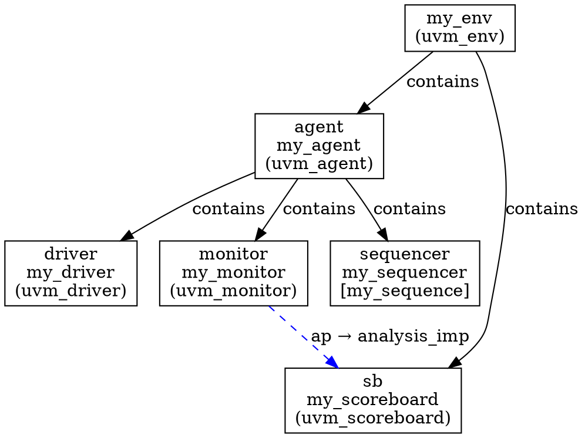
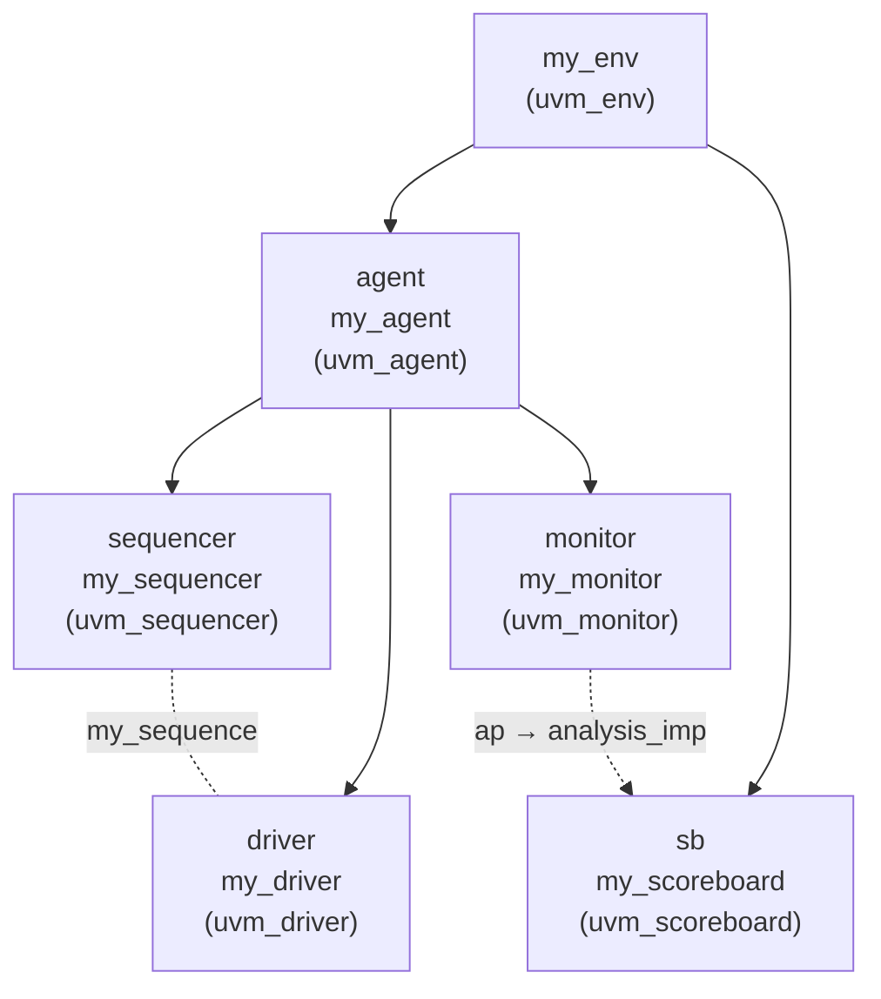

# UVM Testbench 静态骨架提取 Spec

> 版本: v0.1
> 日期: 2026-05-28
> 状态: 已实现

---

## 一、目标

从 UVM testbench 源码中提取静态组件结构，输出为 DOT/Mermaid 图，
作为理解验证环境的入口，为后续深挖提供线索。

### 典型问题

| 问题 | 答案来源 |
|------|---------|
| env 里有哪些组件？ | build_phase 中的 create 调用 |
| driver 接收哪个 sequence 的激励？ | default_sequence 配置 + sequencer 连接 |
| monitor 的 analysis_port 连到了哪里？ | connect_phase 中的 .connect() |
| 组件的继承关系是什么？ | class extends |

---

## 二、提取范围 (Phase 1)

### 2.1 组件层次

**输入**：
```systemverilog
class my_env extends uvm_env;
    my_agent      agent;
    my_scoreboard sb;

    function void build_phase(uvm_phase phase);
        agent = my_agent::type_id::create("agent", this);
        sb = my_scoreboard::type_id::create("sb", this);
    endfunction
endclass
```

**输出**：
```
my_env
├── my_agent (agent)
└── my_scoreboard (sb)
```

**识别规则**：
- `xxx::type_id::create("name", this)` → 建立 parent-child 关系
- `new()` 创建的组件也要识别
- `this` 表示当前组件是 parent
- 第二个参数可以是 `null` (不建立层次) 或其他组件

### 2.2 TLM 连接

**输入**：
```systemverilog
class my_env extends uvm_env;
    function void connect_phase(uvm_phase phase);
        agent.monitor.ap.connect(sb.analysis_imp);
    endfunction
endclass
```

**输出**：
```
agent.monitor.ap → sb.analysis_imp
```

**识别规则**：
- `.connect(target)` 调用
- 源：调用者（如 `agent.monitor.ap`）
- 目标：参数（如 `sb.analysis_imp`）

### 2.3 Sequence → Sequencer 绑定

**输入**：
```systemverilog
class my_test extends uvm_test;
    function void build_phase(uvm_phase phase);
        uvm_config_db#(uvm_object_wrapper)::set(
            this,
            "env.agent.sequencer.run_phase",
            "default_sequence",
            my_sequence::get_type()
        );
    endfunction
endclass
```

**输出**：
```
my_sequence → env.agent.sequencer (default_sequence)
```

**识别规则**：
- `uvm_config_db#(...)::set(ctx, path, "default_sequence", seq::get_type())`
- path 是 sequencer 的路径
- 最后一个参数是 sequence 类型

### 2.4 继承关系

**输入**：
```systemverilog
class my_driver extends uvm_driver#(my_transaction);
class my_agent extends uvm_agent;
```

**输出**：
```
my_driver → uvm_driver (extends)
my_agent → uvm_agent (extends)
```

**识别规则**：
- `class xxx extends yyy` 已有支持（ClassHierarchy）
- 需要识别 UVM 基类类型（uvm_driver, uvm_monitor, etc.）

### 2.5 组件类型推断

| 基类 | 推断类型 |
|------|---------|
| uvm_driver | driver |
| uvm_monitor | monitor |
| uvm_sequencer | sequencer |
| uvm_agent | agent |
| uvm_env | env |
| uvm_test | test |
| uvm_scoreboard | scoreboard |
| uvm_subscriber | subscriber |
| uvm_sequence | sequence |

---

## 三、数据模型

```python
@dataclass
class UVMComponent:
    name: str                     # 实例名 (如 "agent")
    class_name: str               # 类名 (如 "my_agent")
    base_class: str               # UVM 基类 (如 "uvm_agent")
    component_type: str           # 推断类型 (如 "agent")
    parent: str = ""              # 父组件实例名
    children: List[str] = field(default_factory=list)

@dataclass
class TLMConnection:
    source_port: str              # 源端口路径 (agent.monitor.ap)
    target_port: str              # 目标端口路径 (sb.analysis_imp)

@dataclass
class SequenceBinding:
    sequencer_path: str           # sequencer 路径
    sequence_class: str           # sequence 类名

@dataclass
class UVMTestbench:
    components: Dict[str, UVMComponent]  # 实例名 → 组件
    connections: List[TLMConnection]
    sequence_bindings: List[SequenceBinding]
    class_hierarchy: Dict[str, str]      # 类名 → 父类名
```

---

## 四、输出格式

### 4.1 DOT



### 4.2 Mermaid



---

## 五、实现计划

### Phase 1: 静态骨架

| 步骤 | 内容 | 依赖 |
|------|------|------|
| 1 | 组件层次提取 (type_id::create) | pyslang AST |
| 2 | TLM 连接提取 (.connect) | pyslang AST |
| 3 | Sequence 绑定提取 | pyslang AST |
| 4 | 继承关系 | ClassHierarchy (已有) |
| 5 | DOT/Mermaid 输出 | 数据模型 |
| 6 | 集成测试 | OpenTitan DV |

### Phase 2: 配置流 (后续)

| 步骤 | 内容 |
|------|------|
| 1 | config_db set/get 提取 |
| 2 | Factory override 提取 |
| 3 | 虚接口传递追踪 |

---

## 六、文件清单

| 文件 | 操作 | 说明 |
|------|------|------|
| `src/trace/core/graph/uvm_models.py` | 新增 | UVM 数据模型 |
| `src/trace/core/uvm_testbench_extractor.py` | 新增 | 提取器 |
| `sim/tests/regression/test_uvm_testbench.py` | 新增 | 金标准测试 |

---

## 七、待确认

1. **组件识别**：除了 `type_id::create`，还需要识别 `new()` 创建的组件吗？
2. **TLM 端口类型**：需要区分 analysis/put/get/master/slave 吗？还是只记录连接关系？
3. **跨层引用**：`agent.monitor.ap` 这种跨层引用需要解析到完整路径吗？
4. **Phase 识别**：需要区分 build_phase/connect_phase/run_phase 吗？

## 八、已知限制 (Phase 1)

| 限制 | 说明 | 计划 |
|------|------|------|
| parent 使用类名 | `my_agent::build_phase` 中 create 的组件 parent 设为 `my_agent` 而非实例名 `agent` | Phase 2 优化 |
| 只处理 build_phase/connect_phase | run_phase 等其他 phase 未处理 | Phase 2 |
| 不处理 uvm_create/uvm_do | sequence 中的 `uvm_create`/`uvm_do` 等宏未识别 | Phase 2 |
| 不处理 factory override | `set_type_override`/`set_inst_override` 未提取 | Phase 2 |
| 不处理 config_db get | 只处理 set，未处理 get 端 | Phase 2 |
| 虚接口传递 | `uvm_config_db#(virtual if)::set` 未特殊处理 | Phase 2 |
| 参数化类 | `uvm_driver#(my_transaction)` 的参数未提取 | 后续 |

## 九、Plusargs 追踪 (Phase 3)

### 需求

识别 UVM testbench 中的 plusargs（`+uvm_set_*`、`+UVM_VERBOSITY`、自定义 `+xxx`），
标注它们影响的组件/字段位置在图中。

### 典型 plusargs

| plusargs | 影响 |
|----------|------|
| `+uvm_set_type_override=my_transaction,my_special` | factory override |
| `+uvm_set_config_int=*,max_len,256` | config_db 设置 |
| `+UVM_VERBOSITY=UVM_HIGH` | 全局日志级别 |
| `+test_timeout=10000` | 自定义测试参数 |

### 识别方式

1. `+uvm_set_type_override` → 映射为 FactoryOverride
2. `+uvm_set_config_int` / `+uvm_set_config_string` → 映射为 ConfigDBEntry
3. 其他 plusargs → 标记为 TestParameter，关联到使用 `uvm_config_db::get` 或 `$value$plusargs` 的位置

### 输出

在 DOT/Mermaid 图中用特殊颜色/形状标注 plusargs 影响的节点。

### 状态

记录需求，待实现。

## 十、OpenTitan 实测验证 (2026-05-28)

### 测试结果

| 模块 | 组件 | 连接 | Config DB | 结果 |
|------|------|------|-----------|------|
| lc_ctrl | 5 | 6 | 5 | ✅ 全部正确 |
| dma | 3 | 9 | 3 | ✅ 全部正确 |
| i2c | 2 | 14 | 1 | ✅ 全部正确 |
| spi_device | 2 | 5 | 2 | ✅ 正确 |
| rv_dm | 2 | 7 | 2 | ✅ 正确 |
| otbn | 4 | 2 | 3 | ✅ 正确 |
| entropy_src | 1 | 3 | 3 | ✅ 正确 |
| uart | 1 | 2 | 1 | ✅ 正确 |
| kmac | 0 | 2 | 1 | ⚠️ 组件未提取 |
| hmac | 0 | 0 | 0 | ⚠️ 组件未提取 |
| **合计** | **20** | **50** | **21** | |

### 已知提取不到的原因

| 模块 | 原因 |
|------|------|
| hmac | 继承 `cip_base_env` 参数化模板，build_phase 无 create 调用 |
| kmac | 同上 |

### 已知误识别

| 问题 | 说明 |
|------|------|
| 端口对象被当作组件 | `uvm_blocking_put_port` 等端口对象被误识别为组件 |
